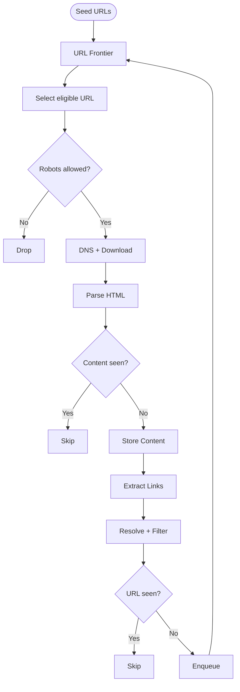

# Project Instructions

## Mermaid Diagram Style Guide

Use Mermaid for architecture diagrams and non-trivial workflows. Diagrams should have a clean, compact system-design style.

### General principles

- Optimize for readability and structure, not for fitting every detail into one diagram.
- Keep diagrams compact, balanced, and easy to scan.
- Prefer simple graph topology. Do not rely on Mermaid's auto-layout to make a complex graph look good.
- If a diagram becomes visually complex, simplify the topology or split it into multiple diagrams.
- Do not change technical meaning merely to improve layout.

### Flow direction

- Use `flowchart TD` by default for workflows and request/data-processing pipelines.
- Keep the primary/happy path vertical and centered.
- Use `LR` only when the architecture naturally represents a left-to-right data flow.
- Avoid flows that zig-zag unnecessarily.

### Nodes

- Use rectangular nodes `[Process]` for normal processing steps.
- Use diamonds `{Decision?}` only for genuine branching decisions.
- Use rounded nodes `([Start])` sparingly for entry/start points.
- Keep node labels short and concise.
- Move detailed explanations into the Markdown prose instead of putting them inside nodes.
- Prefer explicit process nodes over long edge labels.

Prefer:

    A[URL Frontier] --> B[Select eligible URL] --> C{Robots allowed?}

Avoid:

    A[URL Frontier] -->|Select an eligible URL according to scheduling rules| C{Robots allowed?}

### Decisions

- Put `Yes` / `No` labels directly on outgoing decision edges.
- Keep the normal/happy path continuing vertically when possible.
- Put terminal alternatives such as `Skip`, `Drop`, or `Reject` on short side branches.

Example:

    A{Content seen?}
    A -- No --> B[Store Content]
    A -- Yes --> C[Skip]

### Feedback loops

- Avoid long feedback edges that wrap around the entire diagram.
- Never create a huge curved arrow merely to connect a late stage directly to an early stage.
- Introduce a small semantic intermediate node when appropriate.

Prefer:

    A{URL seen?}
    A -- No --> B[Enqueue]
    B --> C[URL Frontier]

over a visually large direct feedback edge when the latter damages the layout.

- Treat graph topology as part of visual design.

### Grouping and abstraction

- Combine tightly related operations when showing them separately adds little value.

For example:

    DNS Lookup + Download
    Resolve + Filter

may be preferable to several tiny nodes in a high-level diagram.

- Architecture diagrams should show components and data flow.
- Algorithm/workflow diagrams should show control flow and decisions.
- Do not mix every implementation detail into a high-level architecture diagram.

### Diagram size

- Prefer roughly 5–12 meaningful nodes per diagram.
- If a diagram requires many branches, loops, or crossing edges, split it into two diagrams.
- A diagram should explain one main idea.

### Styling

- Prefer Mermaid's default/minimal styling.
- Do not add decorative colors unless they convey real semantic meaning.
- Avoid excessive `classDef`, custom CSS, icons, or visual decoration.
- Avoid oversized nodes caused by long text.
- Avoid unnecessary curved/crossing edges.

### Target visual style

A typical workflow should look structurally like:

