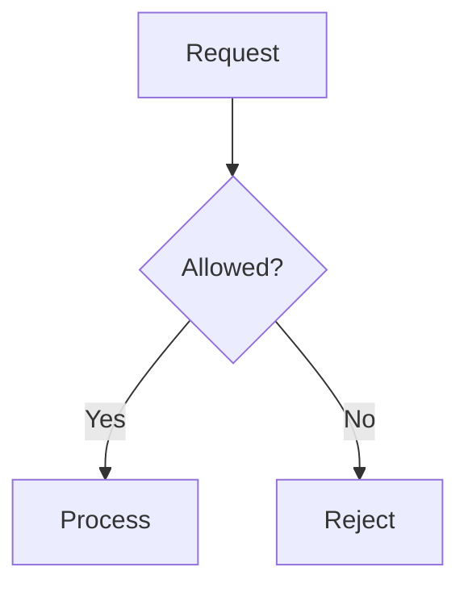

# Alex Duan - Personal Site

This repository contains my personal website and learning notes:
[alexduan-mel.github.io](https://alexduan-mel.github.io/).

I use this site to document what I am learning as a backend engineer,
especially around algorithms and machine learning.

## What You Will Find

- Algorithm notes and LeetCode patterns
- Backend engineering concepts
- Interview prep notes
- Learning logs and technical reflections

## Mermaid Diagrams

Fenced `mermaid` blocks in posts render as static SVG diagrams at build time.
No Mermaid JavaScript is sent to readers. Diagrams use a light canvas in both
site themes and scale down to fit narrow screens without enlarging small diagrams.

After installing dependencies, install the renderer browser once:

```sh
pnpm install
pnpm exec playwright install chromium --only-shell
pnpm dev
```

On a fresh Linux build runner, use
`pnpm exec playwright install --with-deps chromium --only-shell` before building.
The GitHub Actions build and Pages workflows already include this step.

For example, add this to a post:

````markdown

````

Use `accTitle` and `accDescr` to describe diagrams for screen readers.
Invalid Mermaid syntax fails the build so broken diagrams are caught before publishing.

### Shared Theme and Node Classes

`src/plugins/mermaid-theme.mjs` defines the site's Mermaid `base` theme,
`themeVariables`, flowchart spacing, and reusable `classDef` declarations.
The theme applies to all Mermaid blocks. The Markdown plugin adds class definitions
only to `flowchart` / `graph` blocks; other diagram types retain their own syntax.

Use `:::process`, `:::decision`, `:::storage`, or `:::terminal` after a node,
or assign several nodes with `class A,B storage;`. Unclassified flowchart nodes
use the process style. Classes are explicit: a diamond is not automatically
assigned `decision`. Local `classDef` declarations can override the shared defaults.
For use outside this site, copy the shared class definitions along with the diagram.

The draft `src/content/posts/system-design/mermaid-playground.md` contains workflow,
architecture, and sequence examples. Run `pnpm dev` and visit
`/posts/mermaid-playground/` to preview them; drafts are excluded from production.
After changing the theme or Markdown plugin, restart the dev server. If Astro
retains a cached diagram, clear its generated `node_modules/.astro` content cache.

Run `node --test scripts/mermaid-theme.test.mjs` to check class injection.

## Credits

This site is built on top of the
[Fuwari](https://github.com/saicaca/fuwari) Astro blog theme and customized for my own content/workflow.
