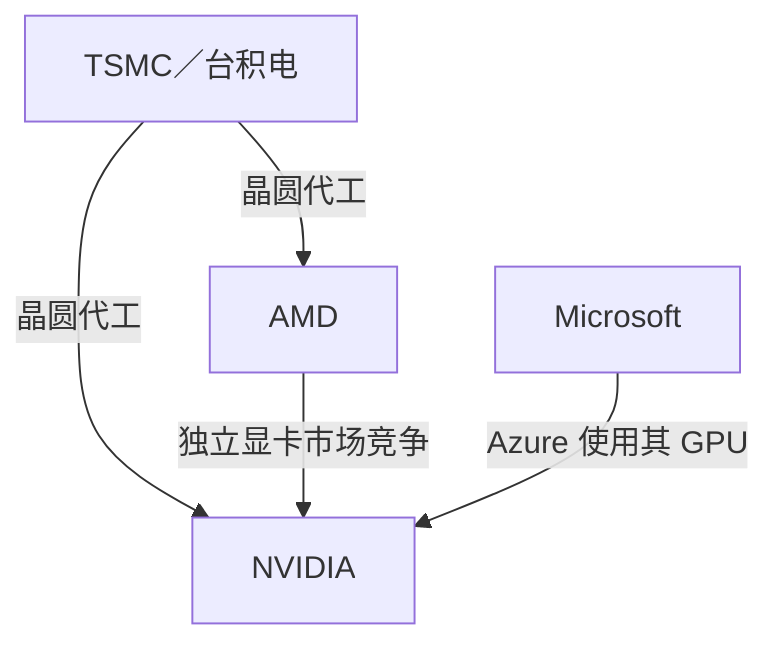
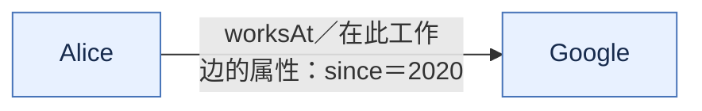
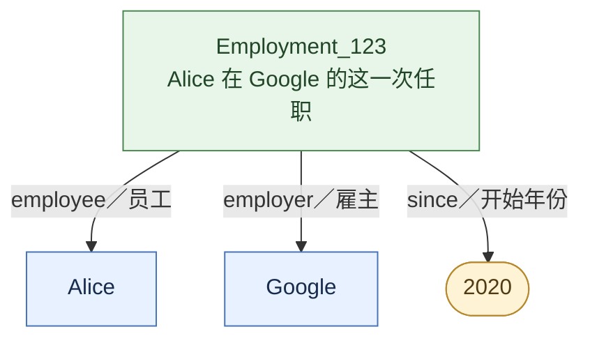
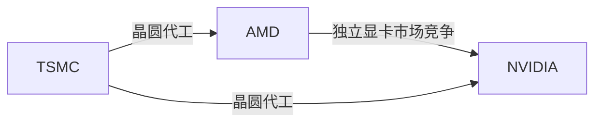

# Knowledge Graphs：从知识表示到大语言模型
## 第一讲：基础、构建与变化

版本：v4 中文修订版 · 2026 年 10 月 4 日  
形式：阅读与分享文稿；中文讲解，保留 English keywords  
参考时长：约 60 分钟，

| 部分 | 参考时间 |
| --- | ---: |
| 1. Google Search 与 Google KG：从使用体验出发 | 7 分钟 |
| 2. NVIDIA 图：实体、关系与两种表示方式 | 10 分钟 |
| 3. 传统构建：从资料到图 | 12 分钟 |
| 4. 查询与使用：组合关系回答问题 | 8 分钟 |
| 5. Petroni 2019：模型是否记住了事实？ | 6 分钟 |
| 6. EDC：LLM 怎样辅助构图？ | 10 分钟 |
| 7. 回顾与讨论 | 7 分钟 |


## 1. Google Search 与 Google KG：从使用体验出发

### 1.1 一个搜索词，可能指不同对象

假设你搜索 `Taj Mahal`。你可能想找印度的泰姬陵，也可能想找同名音乐人。如果系统只把它看成一串文字，很难知道你要的是哪一个对象。

Google 在 2012 年推出 [Knowledge Graph](https://blog.google/products-and-platforms/products/search/introducing-knowledge-graph-things-not/) 时，就用这个例子解释搜索的一项变化：从匹配文字，进一步走向识别文字所指的对象。其表述是 “things, not strings.” [^1]

先从用户能够看到的三个功能理解它：

| 搜索场景 | Google 发布时的例子 | KG 支持的事情 |
| --- | --- | --- |
| 找对对象 | 区分泰姬陵与同名音乐人 | 将名字对应到不同实体 |
| 汇总事实 | 搜索 Marie Curie，查看生平、教育与科学发现 | 围绕同一实体组织事实 |
| 继续探索 | 从人物查看相关人物或作品 | 沿实体之间的关系找到其他对象 |

这里以 2012 年的官方发布说明为案例，不要求今天的搜索界面与当时完全相同。[^1]

### 1.2 为什么需要把信息组织起来？

网页可以用不同写法介绍同一个人，也可以分别描述她的出生地、研究工作和家庭关系。人能够逐页阅读，但如果系统要持续汇总信息，就需要确认哪些名字指向同一对象，以及不同事实如何连接。

KG 把这些信息组织成有明确含义的对象与关系。图不一定要显示给用户看；搜索页面上的一份摘要，可以利用图中围绕某个对象保存的信息。

Google 当时说明，其知识来源包括 Freebase、Wikipedia、CIA World Factbook，以及对 Web 信息的进一步整合。[^1] 这也引出后面要讨论的问题：信息怎样进入图？不同来源怎样对齐？图建好后怎样查询？

Google Search 提供了一个完整的使用案例。接下来，我们用一个更小、可以逐条检查的 NVIDIA 图拆解这些问题。

## 2. NVIDIA 图：实体、关系与两种表示方式

### 2.1 先建立一个能读懂的小图

假设我们正在阅读科技公司的公开资料，希望回答：

> 哪些公司与 NVIDIA 有关联？分别是什么关系？

“相关公司”名单还不够：代工方、竞争对手和产品使用者都有关联，但关系含义不同。先从几份资料选出四条信息。

**TSMC** 是 **Taiwan Semiconductor Manufacturing Company**（台积电）的简称；**GPU** 是 **Graphics Processing Unit**（图形处理器）的缩写。

| 资料支持的信息 | 图中的关系 | 来源 |
| --- | --- | --- |
| NVIDIA 使用包括 TSMC 在内的晶圆代工厂生产半导体晶圆 | TSMC → 为其代工晶圆 → NVIDIA | NVIDIA 2025 财年年报，Manufacturing [^2] |
| AMD 使用 TSMC 生产部分产品的晶圆 | TSMC → 为其代工晶圆 → AMD | AMD 2024 财年年报，Manufacturing Arrangements [^3] |
| AMD 将 NVIDIA 列为独立显卡市场的主要竞争对手 | AMD → 在独立显卡市场竞争 → NVIDIA | AMD 2024 财年年报，Competition in Gaming Segment [^3] |
| Azure ND H100 v5 虚拟机使用 NVIDIA H100 GPU | Microsoft → 在 Azure 服务中使用其 GPU → NVIDIA | Microsoft Azure 2023 年公告 [^4] |



这张图保留了“谁和谁，通过什么关系连接”。Microsoft 的边表达的是产品使用；这份公告并未在这里提供直接采购合同信息。图上的每条边都应保持资料真正支持的范围。

### 2.2 从一条边引入 entity、relation 和 triple

图中的 TSMC 与 NVIDIA 是两个 **entity**（实体），它们之间的“为其代工晶圆”是 **relation**（关系）。把这条陈述写成三个位置，就得到一个 **triple**（三元组）：

> （TSMC，manufacturesWafersFor，NVIDIA）

三个位置分别是 **subject**（主体）、**predicate**（谓词／关系）和 **object**（客体）。在这里，主体是代工方 TSMC，客体是 NVIDIA；如果颠倒它们，含义就改变了。

实体与名称也要区分。“TSMC”“台积电”和英文全称是同一家公司的不同名称。我们需要给这家公司一个稳定的 **identifier**（标识符），再把不同名字作为 **aliases**（别名）关联起来。这样，来自不同资料的边才能接到同一个节点上。

本讲采用的工作定义是：KG 用图结构组织实体及其有明确含义的关系。不同领域的定义侧重不同；我们先用这张小图理解共同的表示思想。[^5]

### 2.3 同一条关系，RDF 与 property graph 怎样表示？

先换一个容易理解的教学例子。假设我们要记录：

> Alice 从 2020 年开始在 Google 工作。

如果只画 Alice → 在此工作 → Google，就丢掉了“从 2020 年开始”。这个年份描述的是 Alice 在 Google 的这一次任职，应当与这段任职关系一起保存。

在 **property graph (PG)**（属性图）中，可以直接给边加 **properties**（属性）。下图把 since＝2020 放在 worksAt 这条边上：[^5]



这条边同时告诉我们：谁在什么公司工作，以及这段任职从哪一年开始。

**Resource Description Framework (RDF)**（资源描述框架）则用 **triple**（三元组）表达陈述。经典 RDF 的三元组本身没有可直接附加键值属性的栏位。[^6] 要把员工、雇主和开始年份组织在一起，一种常见做法是把“这一次任职”建模成一个 **resource**（资源），再用新的三元组描述它。[^16]
如果没有 since 2020, triple可以表示为 (Alice, worksAt, Google)，但是RDF中不能给边添加属性，所以我们可以把“这次 employment relationship”本身也当成一个 entity/resource。



Employment_123 指这一次具体任职。图中的三条箭头分别表达：它的员工是 Alice、雇主是 Google、开始年份是 2020。每条箭头连同两端，仍然是一条三元组。

现在回到 NVIDIA：我们要保存的也不只是“AMD 与 NVIDIA 竞争”，还有“在独立显卡市场”和“来自 AMD 年报”。PG 可以把 market、source 直接放在竞争边上；经典 RDF 可以用一个具体竞争关系的资源，连接两家公司、市场范围和来源。

这展示了一个有实际用途的建模差别：怎样描述关系本身。两者都能保存这些知识；PG 也可以采用任职节点这种结构，RDF 也有其他建模方式。这里选择一组对照，帮助理解常见做法。[^5], [^16]

这里还要分清三个层面：KG 是我们组织起来的知识；RDF 与 property graph 是表达数据的模型；**graph database**（图数据库）是保存和查询数据的软件。开场的节点箭头图则是这些知识的可视化。

<!-- ### 2.4 让关系能够被检查

听到“AMD 与 NVIDIA 竞争”，我们自然会问：在哪个市场？谁提供了这个说法？对应什么时间？

市场范围属于 **qualifier**（限定条件）；年报及对应段落提供 **provenance**（来源与形成过程）信息。资料的发布日期与关系实际成立的时间还要区分：年报提交于某一天，不意味着竞争从那一天才开始。

我们也需要约定关系的含义。例如，manufacturesWafersFor 指晶圆代工，不能混用为整机销售。这类关于实体类型、关系和属性的约定称为 **schema**（模式）。先保持这些约定一致，图里的关系才容易组合和核验。[^5]

可选的小讨论：如果所有边都改叫 relatedTo，我们还能回答什么？哪些问题会失去所需的信息？ -->
### 2.4 只有节点和边还不够

到这里，我们已经可以用 entity 和 relation 画出一张图。但如果这张图真的要被查询、组合和维护，只有“谁和谁相连”还不够。

例如：

> AMD → competesWith → NVIDIA

我们还会自然地追问：

- **这条 relation 到底表示什么？** 是在哪个市场竞争？
- **它在什么条件或时间范围内成立？**
- **这条信息来自哪里？**

因此，一条可用的 KG relation 往往还需要三类信息：

- **Semantics / Schema（语义与模式）**：约定 relation 的含义。例如 `manufacturesWafersFor` 表示晶圆代工，不能和整机销售混为一谈。
- **Qualifier（限定条件）**：补充关系成立的范围，例如“在独立显卡市场”。
- **Provenance（来源）**：记录这条关系由哪份资料支持，例如对应的年报或公告。[^5]

可以把它简单理解为：

```text
AMD ──competesWith──> NVIDIA
      market = discrete graphics
      source = AMD annual report
```

这些信息让图里的关系不只是“有一条边”，而是具有比较明确的含义、上下文和证据。

> **A useful Knowledge Graph needs more than nodes and edges. It also needs semantics, context, and evidence.**

后面讨论 KG construction、LLM 抽取和 explicit knowledge 时，我们还会再次遇到这些问题。

## 3. 传统构建：从资料到图

### 3.1 先看一句话怎样变成一条关系

以下句子根据 NVIDIA 年报概括，用于解释构建流程：[^2]

> NVIDIA 的部分半导体晶圆由台积电（TSMC）代工。

目标是得到前面的 **triple**，并把它连接到正确的公司节点上。从自然语言开始时，一个典型的 **Natural Language Processing (NLP)**（自然语言处理）流程可以分为四步：[^5]

| 步骤 | 要回答的问题 | 本例中的处理 |
| --- | --- | --- |
| Named Entity Recognition（NER，命名实体识别） | 哪些文字是实体名称？ | 找到 NVIDIA、台积电、TSMC，识别为组织名称 |
| Entity linking（实体链接） | 名称指向哪个已有实体？ | 将台积电与 TSMC 链接到同一家公司标识 |
| Relation Extraction（RE，关系抽取） | 原句表达什么关系、方向怎样？ | 识别 TSMC 为 NVIDIA 代工晶圆 |
| 对齐、检查与合并入图 | 能否与已有记录一致地保存？ | 统一关系名称，关联来源，合并重复记录 |

这个流程是帮助理解职责的典型拆解。实际系统可能调整顺序，也可能联合完成几项任务。

### 3.2 每一步怎样做，又容易错在哪里？

NER 可以使用公司词典和规则，也可以训练模型识别名称的边界与类型。例如，标注者先在一批句子中标出组织名称，模型再学习怎样识别新句子中的名称。它找到的是文本片段，还没有确定现实中是哪家公司。

Entity linking 通常先通过名字和别名找到候选，再结合上下文、类型或其他属性判断。没有现成实体可链接时，系统还要决定是否创建新节点。跨记录判断是不是同一对象，常称为 **entity resolution**（实体消歧与归并）。名称相似是线索，不能直接当作身份相同。

RE 可以用规则，也可以用标注数据训练关系分类器。下面两个句式应得到相同方向的关系：

| 原句 | 应表达的关系 |
| --- | --- |
| A 为 B 代工晶圆 | A → 为其代工晶圆 → B |
| B 的晶圆由 A 代工 | A → c → B |

“没有代工”“计划代工”和“已经代工”则表达不同内容。抽取器要识别关系，还要保住否定、条件和时间等上下文。

训练数据也不一定全部由人逐句标注。**Distant supervision**（远程监督）可以利用已有知识库中的关系，为同时提及相关实体的文本提供训练信号。Mintz 等人的 2009 年论文是代表性工作。[^7] 但训练信号会有噪声：知道两家公司存在代工关系，不意味着它们共同出现的每句话都在描述代工。

最后，系统要统一名称与关系词汇，检查方向，关联证据，再合并入图。前一步的错误可能传到后一步：把公司链接错了，即使关系类别判断正确，整条陈述仍然会错。

### 3.3 资料也可以来自表格和人工编辑

KG 的输入不只有文章。下面三个入口都可以产生关系：[^5]

| 输入 | 怎样进入图 | 需要处理的事情 |
| --- | --- | --- |
| 表格、业务数据库 | 将字段映射到实体、关系与属性 | 字段含义、统一标识、重复记录 |
| 文档与网页 | 识别名称，链接实体，抽取关系 | 句意、身份、方向与上下文 |
| 人工编辑或审核 | 直接添加陈述，检查或修正候选 | 词汇一致性、来源与维护记录 |

例如，一张“代工方—客户”表可以直接映射为关系；维护者也可以检查年报后手工加入同一条陈述。实际系统经常组合这些入口。

这里的“传统构建”涵盖规则、任务模型、结构化数据转换和人工维护。它已经包含机器学习，并不是单指手工画图。

### 3.4 辅助案例：Knowledge Vault 的多来源融合

当候选事实来自很多网页和抽取器时，问题会从“能否抽出一条关系”变成“怎样融合不完整、可能有噪声的证据”。

Dong 等人的 *Knowledge Vault: A Web-Scale Approach to Probabilistic Knowledge Fusion*（2014）研究这一问题。它结合从文本、表格、页面结构及人工标注等 Web 内容得到的抽取结果，以及已有知识库提供的先验信息，用学习方法融合证据并估计候选事实的正确概率。[^8]

它适合说明：自动抽取之后，还有证据融合和置信度判断。这是 Google 研究团队的一项公开研究，不能将其等同于 Google KG 的完整实现。

当图持续维护时，还要处理新资料、冲突和过时关系。保留历史记录还是维护当前视图，取决于使用目的；图中缺少一条关系，通常只表示尚未记录。

### 3.5 图建好以后，为什么值得查询？

在进入 LLM 之前，先把前面的构建过程闭环。

假设我们的图中已经有以下三条关系：

- AMD 在独立显卡市场与 NVIDIA 竞争。
- TSMC 为 NVIDIA 代工半导体晶圆。
- TSMC 也为 AMD 代工部分产品的晶圆。

现在问：

> **NVIDIA 的哪些竞争对手与它共享晶圆代工方？**

我们可以沿图中的关系进行匹配：



在当前选入图中的资料范围内，答案是：

- **竞争对手：AMD**
- **共享代工方：TSMC**

这里没有任何一篇资料直接写出：

> “AMD 和 NVIDIA 是共享 TSMC 的竞争对手。”

这个答案来自多条关系的组合。

这就是构建 KG 的一个直接价值：  
当知识已经被表示成明确的实体与关系之后，我们可以对**关系组合**进行查询，而不必每次重新阅读所有原始资料。

当然，这个答案只对当前图中已经记录的资料成立。缺少一条边，并不一定意味着现实中不存在这条关系，也可能只是我们还没有收集到。

到这里，LLM 之前的整体流程可以简化为：

```text
Documents / Tables / Databases
            ↓
       Information Extraction
            ↓
 Entity Linking / Relation Extraction
            ↓
 Fusion / Validation / Provenance
            ↓
       Knowledge Graph
            ↓
          Query
```

接下来，LLM 的出现改变了这条流程中的很多步骤，也引出了一个很自然的问题。

---

## 4. LLM 出现之后：两种知识表示开始相遇

### 4.1 一个很自然的问题

再看一个更简单的问题：

> **NVIDIA 的一家晶圆代工方是谁？**

按照前面讲过的传统流程，我们可能要：

1. 找到相关资料；
2. 识别 NVIDIA 和 TSMC；
3. 判断它们之间的关系；
4. 把关系统一、检查后写入 KG；
5. 再通过查询得到答案。

但在今天，我们也可以直接问一个 LLM。

这就产生了一个非常自然的问题：

> **如果 LLM 已经能够直接回答事实问题，为什么还要构建 Knowledge Graph？**

这个问题并不是 ChatGPT 出现之后才有。

Petroni 等人在 2019 年的论文 *Language Models as Knowledge Bases?* 中，就直接提出了一个很有启发性的问题：

> **预训练语言模型的参数中，是否已经保存了可以被“查询”出来的事实知识？** [^10]

这实际上把我们带到了 KG 与语言模型之间最重要的一个连接点。

---

### 4.2 LAMA 真正在测什么？

Petroni 等人提出了 **LAMA**（LAnguage Model Analysis）探测评估。

它从已有知识来源中取得带标准答案的事实，并把事实转成填空形式。例如，概念上可以把：

> Dante was born in Florence.

改写成：

> Dante was born in ______.

然后让一个**已经完成预训练的语言模型**预测缺失内容。

这里需要特别注意：

> **LAMA 并不是专门拿“模型从未见过的新事实”来测试它的推理能力。**

相反，它关心的是：

> 一个已经在大规模文本上完成预训练的模型，在测试时不给支持文档、也不针对这些事实继续 fine-tuning，能否从模型参数中恢复出 factual knowledge？

因此，LAMA 更像是在做一种 **knowledge probing（知识探测）**。

例如，T-REx 部分使用来自 Wikidata 的事实，并与 Wikipedia 文本进行对齐；而 BERT 本身的预训练数据也包含 Wikipedia。也就是说，一些测试事实完全可能以某种形式出现在模型的预训练语料中。[^10]

所以它并不是在证明：

> “模型能够推出自己从未接触过的事实。”

它更接近于证明：

> **大量文本训练之后，一部分事实信息会以某种隐式形式进入语言模型参数，并且可以通过 prompt 被恢复出来。**

论文还发现，不同 **relation types（关系类型）** 的恢复效果差异明显。

例如，模型对于某些类型的事实——如出生地、国籍、职业或地理关系——可能表现较好，而对另一些关系表现较差。

因此，模型并不是均匀地“记住了一个知识库”。

更准确地说：

> **它从训练文本中学到了大量分布式的语言模式，其中也包含一部分可恢复的事实知识。**

---

### 4.3 两条路线：显式知识与参数化知识

到这里，可以暂时把 KG 和语言模型看成两条不同的知识表示路线。

第一条路线，是我们前面一直在讲的 **explicit knowledge（显式知识）**：

```text
Knowledge Graph

NVIDIA
   ↑
manufacturesWafersFor
   |
 TSMC
```

知识被明确表示为：

> entity + relation + entity

我们可以检查节点、关系、schema、来源和时间。

另一条路线，是语言模型中的 **parametric knowledge（参数化知识）**：

```text
Large-scale text
      ↓
Language Model Training
      ↓
Model Parameters
```

知识并没有以一条条 triple 的形式直接暴露出来，而是分布式地编码在参数中。

可以做一个非常简化的对照：

| Explicit knowledge / KG | Parametric knowledge / LM |
| --- | --- |
| entity 与 relation 显式存在 | 知识隐式分布在参数中 |
| 可以直接检查记录 | 很难定位某条事实存在哪里 |
| 可以查询明确关系 | 通过 prompt 诱发模型生成答案 |
| 可以修改单条记录 | 单条事实通常不能直接局部修改 |
| 可以绑定 provenance | 参数本身通常不提供事实来源 |
| schema 可以被明确规定 | 语义结构主要隐含在模型表示中 |

这两条路线并不是完全隔离的。

在 LLM 兴起之前和早期，就已经有研究尝试把知识库或 KG 信息注入语言模型；反过来，语言模型也一直被用于 information extraction 等 KG 构建任务。[^14]

但以 GPT-3 为代表的 scaling 路线说明了另一件很重要的事：

> **并不需要先构建一个覆盖世界知识的大型 KG，模型也可以仅通过大规模文本上的 language modeling 学到大量语言能力和事实关联。**

GPT-3 的核心训练路线是 autoregressive language modeling，使用大规模文本数据，包括 Common Crawl、WebText、Books 和 Wikipedia，而不是以某个 KG 作为主要训练 backbone。[^17]

这让一个原本并不荒谬的问题变得更加现实：

> **如果模型自己已经能“知道”这么多东西，显式知识表示是不是不再必要？**

---

### 4.4 KG 并不是在所有场景下都不可替代

这里最容易掉进另一个极端：

> “LLM 有缺点，所以 KG 一定不可替代。”

这个说法也不准确。

事实上，一些过去可能需要复杂 information extraction 或 ontology engineering 的任务，现在完全可能直接用 LLM 或 LLM + document retrieval 完成。

例如，如果任务只是：

> “根据这几份资料介绍一下 NVIDIA 的业务。”

那么先构建完整 KG 可能并不划算。

因此，真正的问题不是：

> **KG 会不会被 LLM 淘汰？**

而是：

> **什么时候值得把知识显式表示出来？**

如果一个系统只需要“读懂”和“总结”文本，LLM 往往已经非常有竞争力。

但当系统开始要求以下能力时，显式知识的价值会重新变得明显：

- **Canonical identity（统一实体身份）**  
  `TSMC`、`台积电`、`Taiwan Semiconductor Manufacturing Company` 是否必须稳定地指向同一个对象？

- **Typed relationships（明确关系类型）**  
  `manufacturesWafersFor`、`usesGPUFrom`、`competesWith` 能不能明确区分？

- **Provenance（来源）**  
  一条关系到底由哪份资料、哪一段内容支持？

- **Controlled update（受控更新）**  
  某一条事实变化时，能否明确修改它，而不是重新训练整个模型？

- **Structured query（结构化查询）**  
  能否稳定地找到满足一组关系条件的全部对象？

- **Traversal / composition（关系遍历与组合）**  
  能否沿多条关系寻找供应链、依赖链、组织网络或其他路径？

这里也需要保持一个边界：

> **这些能力并不全部是 KG 独占的。**

Relational database、document database、search system 或 master data platform 也可以提供其中一部分能力。

KG 特别适合的场景，是领域中的核心信息天然围绕：

> **entities + typed relationships + traversal / composition**

来组织。

例如：

```text
company ↔ supplier ↔ factory ↔ country

drug ↔ protein ↔ disease

person ↔ company ↔ investment

account ↔ transaction ↔ device
```

在这些场景里，**关系结构本身就是知识的一部分**。

---

### 4.5 所以，LLM 和 KG 不是简单的替代关系

现在再回头看 LLM 和 KG，会更容易理解它们为什么会同时存在。

我们可以把问题理解成：

> **现在有两种非常不同的知识载体。怎样把它们连接起来？**

```text
                   Knowledge
                  /         \
                 /           \
                ↓             ↓

      Explicit knowledge    Parametric knowledge
             KG                   LLM

   identity / relations      language / patterns
   schema / provenance       distributed parameters
   query / update            generation / generalization
```

从这里，才自然产生后面的三个方向：

```text
LLM → KG
利用语言模型，把非结构化信息转成显式知识。

KG → LLM
让语言模型访问显式、结构化、可更新的外部知识。

LLM + KG
让两种知识表示在同一个系统里各自承担擅长的部分。
```

所以这里的 **KG → LLM** 并不是：

> “KG 为了不被淘汰，只好去帮助 LLM。”

更准确地说，它是在回答：

> **当一个 LLM-based system 需要模型参数之外的 explicit knowledge 时，这些知识应该怎样组织和提供？**

而 external knowledge 也不一定必须是 KG。

它可以来自：

```text
             External Knowledge
                    |
        -------------------------
        |           |           |
        ↓           ↓           ↓
   Documents    Databases       KG
        \           |           /
         \          |          /
          Retrieval / Tools
                  ↓
                 LLM
```

KG 是其中一种结构化程度很高的选择。

因此，这一讲后半部分真正想建立的不是：

> **KG vs. LLM**

而是：

> **Explicit knowledge 与 parametric knowledge 如何分工，又如何协作？**

接下来三个 section，就分别从 **LLM → KG、KG → LLM、LLM + KG** 来看这个问题。

---

## 5. LLM → KG：LLM 能不能让构图更容易？

### 5.1 重新看传统构建流程

前面我们介绍过一个典型的文本构图流程：

```text
Text
  ↓
Named Entity Recognition
  ↓
Entity Linking
  ↓
Relation Extraction
  ↓
Alignment / Validation / Fusion
  ↓
Knowledge Graph
```

传统上，这些步骤可能分别依赖：

- 规则；
- 词典；
- task-specific models；
- 标注数据；
- 人工审核；
- 或多种方法的组合。

现代 LLM 带来的一个很直接的变化是：

> **同一个通用模型可以承担多个语言理解任务。**

例如，给模型一句：

> NVIDIA 使用包括 TSMC 在内的晶圆代工厂生产半导体晶圆。

我们可以要求模型直接输出结构化候选：

> （TSMC，manufacturesWafersFor，NVIDIA）

甚至可以进一步要求它输出 JSON、triples 或符合某种 schema 的结构。

于是从表面上看，原来的多阶段流程似乎可以简化成：

```text
Text
  ↓
LLM
  ↓
Structured candidates
```

这确实是 LLM 对 KG construction 带来的一个重要变化：

> **从自然语言到结构化候选知识的成本明显降低了。**

但这还不等于：

> **Text → LLM → 完成的 Knowledge Graph**

### 5.2 生成 triples 之后，老问题又回来了

先看 entity identity。

```text
TSMC
Taiwan Semiconductor Manufacturing Company
台积电
```

LLM 很可能知道这些名称通常指的是同一家公司。

但 KG 仍然需要明确决定：

> 这些 mention 是否应该指向同一个稳定的 entity identifier？

再看 relation：

```text
producesWafersFor
fabricatesWafersFor
manufacturesWafersFor
```

这些词在某些上下文中可能表达相同的语义。

但如果每一种自然语言表达都直接成为一个 relation，图中的关系词汇会迅速膨胀，查询也会变得困难。

反过来，如果过度合并，又可能把原本不同的关系错误地压成同一种关系。

此外，还有很多前面已经见过的问题：

- 这条关系真的被原文支持吗？
- subject 和 object 的方向是否正确？
- “计划合作”有没有被误写成“已经合作”？
- 模型有没有补出原文没有说过、但听起来合理的内容？
- 时间范围是否正确？
- provenance 应该关联到哪一段原文？
- 新资料出现后，如何更新已有事实？

因此：

> **LLM 可以显著改善 extraction，但 extraction 只是 KG construction 的一部分。**

### 5.3 一个代表性例子：Extract, Define, Canonicalize

Zhang 和 Soh 在 2024 年提出的 **EDC**：

> **Extract, Define, Canonicalize**

提供了一个很适合说明这个问题的例子。[^11]

可以把三个步骤简单理解为：

| 步骤 | 作用 | NVIDIA 教学例子 |
| --- | --- | --- |
| **Extract（抽取）** | 从文本中提出候选关系 | TSMC → producesWafersFor → NVIDIA |
| **Define（定义）** | 解释当前 relation 在上下文中的含义 | 前者为后者生产晶圆 |
| **Canonicalize（规范化）** | 把不同表达对齐到统一关系词汇 | producesWafersFor → manufacturesWafersFor |

为什么中间需要一个 **Define**？

因为只看 relation label 本身并不总是可靠。

两个名字不同的 relation 可能表达同样的意思；两个名字看起来相似的 relation，也可能实际上不同。

如果先把 relation 的语义解释出来，再做 canonicalization，就能提供更多判断依据。

这类方法说明了 LLM → KG 的一个典型思路：

> **让 LLM 负责理解自然语言和提出结构化候选，再把结果纳入一个需要 identity、schema、consistency 和 provenance 的知识系统。**

EDC 并不是完整解决方案。其他研究还会继续处理：

- entity merging / entity resolution；
- schema alignment；
- factual refinement；
- validation；
- continuous update。

这次我们不展开这些具体方法。

这一部分只保留一个 key point：

> **LLMs make knowledge extraction more flexible, but they do not eliminate the need for knowledge organization and maintenance.**

---

## 6. KG → LLM：Knowledge Graph 又能给 LLM 什么？

前面讨论的是：

> **language → LLM → structured knowledge**

现在把方向反过来：

> **structured knowledge → LLM**

也就是说，如果我们已经有一个 KG，它能不能反过来帮助 LLM？

答案是可以。

### 6.1 External knowledge：模型不必把所有知识都放在参数里

一个现代 LLM application 不一定只依赖模型参数中的知识。

它也可以在回答问题之前，先从外部数据源检索相关内容，再把这些内容交给模型。

这就是 **Retrieval-Augmented Generation（RAG，检索增强生成）** 的基本思想：

```text
Question
   ↓
Retrieve external information
   ↓
LLM
   ↓
Answer
```

最常见的 external information 是文档中的 text chunks。

但文档并不是唯一的外部知识来源。

**Knowledge Graph 也可以成为一种 external knowledge source。**

```text
Question
   ↓
Retrieve entities / relations / paths
   ↓
LLM
   ↓
Answer
```

这样，KG 的角色发生了变化。

前面我们是：

> **直接查询 KG 得到答案。**

现在也可以变成：

> **让 KG 给 LLM 提供相关结构化知识，再由 LLM 组织最终答案。**

### 6.2 为什么 graph structure 可能有帮助？

还是回到前面的 NVIDIA 问题：

> **NVIDIA 的哪些竞争对手与它共享晶圆代工方？**

我们的图中明确记录了：

```text
AMD ──competesWith──> NVIDIA

TSMC ──manufacturesWafersFor──> AMD

TSMC ──manufacturesWafersFor──> NVIDIA
```

这里有价值的不只是：

> AMD、NVIDIA、TSMC 这几个名字都出现在某些文档里。

更重要的是：

> **它们之间的关系已经被明确表示出来。**

因此，一个 KG 可以向 LLM 提供：

- **Entities（实体）**
- **Relationships（关系）**
- **Paths（路径）**
- **Types（类型）**
- **Provenance（来源）**
- **Structured constraints（结构化约束）**

LLM 再根据这些信息生成自然语言答案。

例如：

> 在当前选入图中的资料中，AMD 是 NVIDIA 在独立显卡市场的竞争对手，而两家公司都使用 TSMC 进行晶圆代工。

这里可以把两者的分工理解成：

> **KG 提供明确的结构和证据入口；LLM 负责理解问题并组织答案。**

### 6.3 为什么不直接用模型自己的知识？

因为实际应用中的知识需求，可能和模型训练时学到的内容完全不同。

例如，一个系统可能需要：

- 企业内部数据；
- 最近刚更新的信息；
- 特定行业中的专业术语；
- 统一的 entity identifiers；
- 可追溯的 evidence；
- 需要精确查询的关系；
- 有明确权限控制的数据。

这些知识未必适合放进模型参数里。

而且如果某一条事实发生变化，更新外部知识通常比重新训练模型更直接。

这并不意味着：

> **所有 LLM application 都应该建立 KG。**

很多任务中，普通的 document retrieval 已经足够简单、有效。

真正值得问的问题是：

> **When is explicit relationship structure worth the cost?**  
> **什么时候显式维护关系结构带来的收益，足以抵偿构建和维护成本？**

在这个方向上，后来又发展出了 graph-based retrieval、KG-RAG、GraphRAG 等很多方法。

这些内容已经足够单独成为下一讲，因此这次只停在这里。

这一节的 key point 是：

> **KG → LLM：Knowledge Graph 可以作为一种外部、结构化、可检查的知识来源。**

---

## 7. LLM + KG：替代关系，还是协作关系？

现在回到后半场一开始的问题：

> **LLM 时代，Knowledge Graph 还有没有用？**

如果把 LLM 和 KG 当成两个互相竞争的“知识库”，这个问题很容易变成：

> 谁会替代谁？

但实际上，两者擅长的问题并不完全相同。

| LLM 更擅长 | Knowledge Graph 更擅长 |
| --- | --- |
| 理解自然语言 | 显式表示知识 |
| 从 messy text 中抽取信息 | 维护稳定的 entity identity |
| 处理多样的语言表达 | 明确表示 relationships |
| 生成自然语言答案 | 结构化、可重复的查询 |
| 灵活处理不同任务 | provenance 与 auditability |
| 把非结构化信息转成结构化候选 | 对单条事实进行受控更新 |

因此，LLM 和 KG 之间可以形成三个方向。

### 7.1 LLM → KG

LLM 可以帮助：

- information extraction；
- entity / relation identification；
- schema mapping；
- canonicalization；
- enrichment；
- validation / refinement。

也就是说：

> **LLM 帮助把 language 变成 explicit knowledge。**

### 7.2 KG → LLM

KG 可以提供：

- external factual knowledge；
- explicit relationships；
- structured retrieval；
- provenance；
- domain-controlled entities and schemas；
- 可以独立于模型训练进行更新的知识。

也就是说：

> **KG 帮助 LLM 获得更明确、更可控制的外部知识。**

### 7.3 LLM + KG

如果把两边连接起来，一个非常简化的系统可以是：

```text
Documents / Data
       ↓
      LLM
 extract / interpret
       ↓
Knowledge Graph
       ↓
 retrieve / query
       ↓
      LLM
 explain / answer
```

第一段：

> LLM 帮助理解自然语言，并从中提取候选知识。

中间：

> KG 保存我们选择显式维护的知识，以及实体、关系、schema 和 provenance。

最后：

> LLM 再利用这些结构化知识生成对人更友好的回答。

现实中的系统当然可能更复杂，还可能包含：

- vector database；
- search engine；
- relational database；
- rules；
- APIs；
- human review；
- agents；
- 其他 retrieval components。

但这个简化图足以说明一个重要变化：

> **LLM 和 Knowledge Graph 并不一定是 replacement relationship。它们也可以是 collaboration relationship。**

Pan 等人的相关工作把这一研究版图概括为包括：

- **LLM-augmented KGs**
- **KG-enhanced LLMs**
- 更深层次的 LLM–KG synergy

等方向。[^13], [^14]

### 7.4 回到最开始的问题

我们从 Google Search 的一句话开始：

> **things, not strings**

Knowledge Graph 的核心价值，是给对象明确的 identity，并把对象之间有意义的关系显式表示出来。

然后我们看到，LLM 出现以后发生了两件事：

第一：

> **从自然语言中提取结构化知识变容易了。**

第二：

> **LLM application 本身又产生了对 external、structured、inspectable knowledge 的需求。**

所以，LLM 时代的 KG 并不是简单地“被替代”。

更准确地说：

> **LLMs reduce some of the cost of building and using Knowledge Graphs, while also creating new ways to use explicit structured knowledge.**

因此，我们接下来真正值得讨论的问题，不再是：

> **LLM or KG?**

而是：

> **哪些知识值得显式维护？什么时候值得构建一张图？LLM 应该怎样使用这张图？**

这也是后续几讲可以继续展开的方向。

例如：

- **From RAG to GraphRAG：什么时候 graph structure 能改善 retrieval？**
- **LLM-based KG Construction：LLM 构图到底有多可靠？**
- **Reasoning over Knowledge Graphs：图上的查询、推理与预测有什么区别？**
- **Agents + Knowledge Graphs：KG 能否作为长期 memory 或 world model？**

这次第一讲的目标不是回答这些问题，而是先建立一张地图：

```text
Before LLMs
    ↓
How do we represent and construct explicit knowledge?

After LLMs
    ↓
LLM → KG
KG → LLM
LLM + KG
```

如果听众最后能够理解这张地图，并知道为什么今天仍然有人研究 Knowledge Graph，那么这一讲的目标就已经完成了。

---

## 补充阅读

首次接触 KG，可以优先回看第 2–3 节，理解 entity、relation、triple、schema、provenance，以及从文本到图的基本流程。[^5]

如果想理解“语言模型是否能够保存事实知识”这一问题，可以看 Petroni 等人的 *Language Models as Knowledge Bases?*。[^10]

如果想继续了解 LLM 如何参与 KG construction，可以看 EDC。[^11]

如果想了解 LLM 与 KG 更完整的研究版图，可以参考两篇 overview / roadmap 类工作。[^13], [^14]

Graph-based RAG、GraphRAG 以及更具体的 KG-enhanced LLM 方法留到后续分享再展开。

## References

[^1]: A. Singhal, “Introducing the Knowledge Graph: things, not strings,” *Google Blog*, May 16, 2012. [Online](https://blog.google/products-and-platforms/products/search/introducing-knowledge-graph-things-not/).

[^2]: NVIDIA Corporation, *Form 10-K for the Fiscal Year Ended January 26, 2025*, filed Feb. 26, 2025, Item 1, “Manufacturing.” [Online](https://www.sec.gov/Archives/edgar/data/1045810/000104581025000023/nvda-20250126.htm).

[^3]: Advanced Micro Devices, Inc., *Form 10-K for the Fiscal Year Ended December 28, 2024*, filed Feb. 5, 2025, Item 1, “Manufacturing Arrangements” and “Competition in Gaming Segment.” [Online](https://ir.amd.com/financial-information/sec-filings/content/0000002488-25-000012/amd-20241228.htm).

[^4]: Microsoft Azure, “Scale generative AI with new Azure AI infrastructure advancements and availability,” Aug. 7, 2023. [Online](https://azure.microsoft.com/en-us/blog/scale-generative-ai-with-new-azure-ai-infrastructure-advancements-and-availability/).

[^5]: A. Hogan et al., “Knowledge Graphs,” *ACM Computing Surveys*, vol. 54, no. 4, Art. 71, 2021. [doi:10.1145/3447772](https://doi.org/10.1145/3447772). [Preprint](https://arxiv.org/abs/2003.02320).

[^6]: World Wide Web Consortium, *RDF 1.1 Primer*, W3C Working Group Note, 2014. [Online](https://www.w3.org/TR/rdf11-primer/).

[^7]: M. Mintz, S. Bills, R. Snow, and D. Jurafsky, “Distant supervision for relation extraction without labeled data,” in *Proceedings of ACL-IJCNLP*, pp. 1003–1011, 2009. [Online](https://aclanthology.org/P09-1113/).

[^8]: X. L. Dong et al., “Knowledge Vault: A Web-Scale Approach to Probabilistic Knowledge Fusion,” in *Proceedings of the 20th ACM SIGKDD International Conference on Knowledge Discovery and Data Mining*, pp. 601–610, 2014. [Online](https://research.google/pubs/knowledge-vault-a-web-scale-approach-to-probabilistic-knowledge-fusion/).

[^9]: A. Bordes, N. Usunier, A. Garcia-Durán, J. Weston, and O. Yakhnenko, “Translating Embeddings for Modeling Multi-relational Data,” in *Advances in Neural Information Processing Systems*, vol. 26, 2013. [Online](https://proceedings.neurips.cc/paper_files/paper/2013/hash/1cecc7a77928ca8133fa24680a88d2f9-Abstract.html).

[^10]: F. Petroni et al., “Language Models as Knowledge Bases?,” in *Proceedings of EMNLP-IJCNLP*, pp. 2463–2473, 2019. [Online](https://aclanthology.org/D19-1250/).

[^11]: B. Zhang and H. Soh, “Extract, Define, Canonicalize: An LLM-based Framework for Knowledge Graph Construction,” in *Proceedings of the 2024 Conference on Empirical Methods in Natural Language Processing*, pp. 9820–9836, 2024. [Online](https://aclanthology.org/2024.emnlp-main.548/).

[^12]: B. Mo et al., “KGGen: Extracting Knowledge Graphs from Plain Text with Language Models,” in *Advances in Neural Information Processing Systems*, vol. 38, 2025. [Online](https://proceedings.nips.cc/paper_files/paper/2025/hash/2b368455e832d2b1a60bcad8c4c6481f-Abstract-Conference.html).

[^13]: J. Z. Pan et al., “Large Language Models and Knowledge Graphs: Opportunities and Challenges,” *Transactions on Graph Data and Knowledge*, vol. 1, no. 1, Art. 2, pp. 2:1–2:38, 2023. [doi:10.4230/TGDK.1.1.2](https://doi.org/10.4230/TGDK.1.1.2). [Preprint](https://arxiv.org/abs/2308.06374).

[^14]: S. Pan et al., “Unifying Large Language Models and Knowledge Graphs: A Roadmap,” *IEEE Transactions on Knowledge and Data Engineering*, 2024. [doi:10.1109/TKDE.2024.3352100](https://doi.org/10.1109/TKDE.2024.3352100). [Preprint](https://arxiv.org/abs/2306.08302).

[^15]: D. Kim, H. Yang, S. Hwang, K.-H. Lee, and C. Lee, “LLMs as Knowledge Graph Refiners: Mitigating Factual Inconsistencies in Generative Knowledge Extraction,” in *Proceedings of the 64th Annual Meeting of the Association for Computational Linguistics, Volume 1: Long Papers*, pp. 29358–29378, 2026. [Online](https://aclanthology.org/2026.acl-long.1353/).

[^16]: N. Noy and A. Rector, Eds., *Defining N-ary Relations on the Semantic Web*, W3C Working Group Note, Apr. 12, 2006. [Online](https://www.w3.org/TR/swbp-n-aryRelations/).

[^17]: T. B. Brown et al., “Language Models are Few-Shot Learners,” in *Advances in Neural Information Processing Systems*, vol. 33, 2020. [Online](https://proceedings.neurips.cc/paper_files/paper/2020/hash/1457c0d6bfcb4967418bfb8ac142f64a-Abstract.html).
