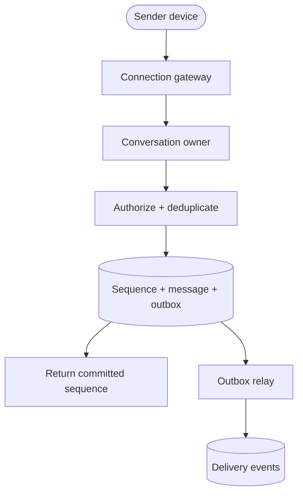
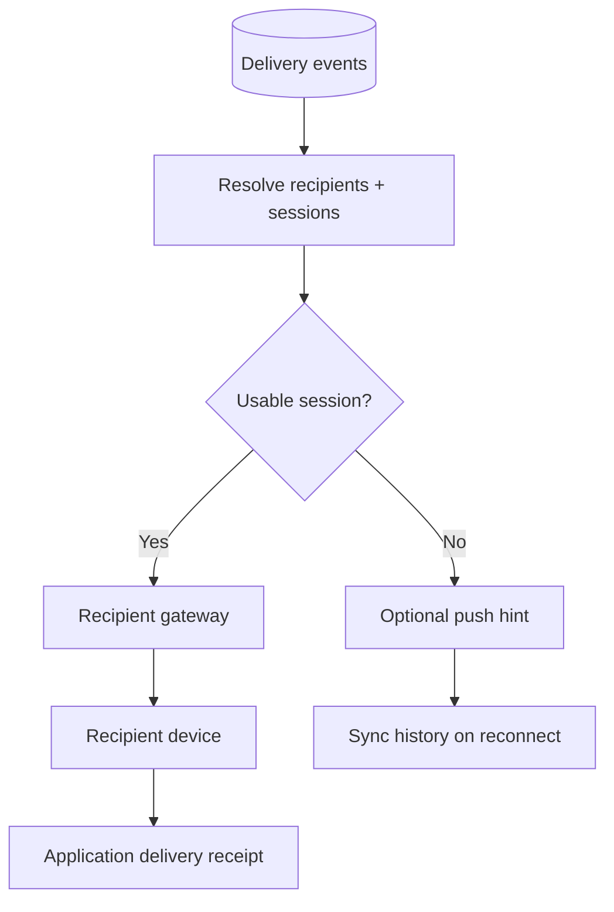

## Design at a Glance

**Scope:** one-to-one text messaging, groups of up to 100 members, online presence, multiple devices per account, and offline notifications. Use the chapter's 50 million daily active users as the starting scale. Target low delivery latency for connected recipients and retain durable history for reconnecting devices.

Nail down the delivery contract before choosing components:

| Question | Working assumption |
| --- | --- |
| What does “sent” mean? | The server has durably committed the message, not merely received a socket frame. |
| What order matters? | A shared server-accepted order within each conversation; no global order across unrelated chats. |
| What happens offline? | Devices catch up from stored history; push notifications only prompt them to reconnect. |
| What are the limits? | Bound message bytes, group size, per-user send rate, and per-device output buffers. |
| How long is history retained? | Long-term retention for this exercise; agree on deletion and archival rules before sizing production storage. |

Attachments, search, voice/video, and end-to-end encryption are separate extensions. TLS protects transport in this baseline; it does not prevent the service from reading stored plaintext.

### Size Messages and Connections Separately

Additional illustrative assumptions:

```text
50 million DAU × 20 messages/day = 1 billion messages/day
                                 ≈ 11,600 accepted messages/second
5× peak                          ≈ 58,000 messages/second
1 billion × 1 KB/message          ≈ 1 TB/day, or 365 TB/year

1 million simultaneous devices × 10 KB/connection ≈ 10 GB
```

These are planning estimates, not benchmarks. Storage excludes indexes, replicas, delivery events, and backups. The connection estimate excludes much of the TLS, kernel, and application buffering overhead. DAU does not equal concurrent connections, and group fan-out can multiply outbound traffic far beyond the accepted-message rate. Spread connections across failure domains even if a memory estimate appears to fit one host.

## Connections, Routing, and Service Discovery

| Transport | Behavior | Trade-off |
| --- | --- | --- |
| Polling | Ask for updates periodically. | Simple, but empty requests waste work and the interval adds latency. |
| Long polling | Hold a request until data arrives or a timeout occurs, then issue another. | Useful fallback; repeated requests and pending-request routing still need management. |
| WebSocket | Maintain a bidirectional connection for messages and acknowledgments. | Efficient live interaction, with explicit connection recovery and flow control. |

Choose `wss://` for live messaging and HTTPS for login, membership management, and history queries. [RFC 6455](https://www.rfc-editor.org/rfc/rfc6455) defines the WebSocket handshake and bidirectional framing, including Ping/Pong for liveness. HTTP keep-alive reuses a connection; it does not by itself provide unsolicited chat updates. WebSocket also does not provide durable application delivery or reconnect replay.

Keep three responsibilities distinct:

| Component | Responsibility |
| --- | --- |
| API services | Authenticate accounts, manage conversations, and authorize history reads. |
| Connection gateways | Own live sockets and bounded output buffers; forward commands to the responsible conversation service. |
| Conversation service | Authorize sends, serialize each conversation's writes, and persist messages and delivery work. |

An authenticated connection registers `(user_id, device_id, session_id) → gateway_id` in a session directory with an expiry. Delivery looks up **all eligible sessions**, including the sender's other devices. A socket stays with its gateway for its lifetime; reconnecting can select another gateway and replace the directory entry. Session generations prevent an old disconnect handler from deleting a newer connection.

**Apache ZooKeeper** can support gateway registration and conversation-owner coordination. Its ephemeral nodes disappear when their owning session expires, and watches inform discovery clients of changes. It is designed for small coordination data, not chat history; see the [ZooKeeper programmer's guide](https://zookeeper.apache.org/doc/current/zookeeperProgrammers.html). The application or load balancer chooses a gateway using health, region, and load—ZooKeeper does not automatically choose the “best” server. Keep high-volume device heartbeats in a separate session/presence service.

## Store by Conversation and Message Order

Both direct and group chats can use the same message model:

| Record | Key fields | Purpose |
| --- | --- | --- |
| Conversation | `conversation_id`, type, membership version | Defines the chat and its access rules. |
| Message | `conversation_id`, `sequence`, sender, client request ID, body, timestamp | Durable ordered history. |
| Idempotency record | Conversation, sender, client request ID → committed sequence | Maps a repeated send to the original result. |
| Device progress | User, device, conversation, sync cursor | Tracks what that device has durably synchronized. |
| Receipt | Conversation, user/device, delivered or read position | Distinguishes delivery from user engagement. |

A **composite key** `(conversation_id, sequence)` supports bounded history scans such as “the next 50 messages after this position.” A lookup by message ID alone is insufficient for efficient conversation history. Cache recent pages; use cursor-based queries for older messages.

For a concrete baseline, use a sharded transactional store with each conversation's messages, sequence state, idempotency records, and outbox colocated. This makes the commit boundary below explicit. A wide-column store or replicated log can also work, but its conditional-write, ordering, and recovery guarantees must support the same invariants; “NoSQL scales” is not a sufficient selection argument.

Long-lived conversations may need time or sequence-range buckets to bound physical partitions. Discord's [message-storage engineering account](https://discord.com/blog/how-discord-stores-trillions-of-messages) describes channel-and-time-bucket partitioning and the hot-partition problems encountered during its migration from Cassandra to ScyllaDB. Bucketing limits partition size; it does not eliminate a popular conversation's current write hotspot. Preserve an index for locating buckets and paginate across their boundaries.

## Local Sequence Numbers: Order Within a Conversation

A local sequence number generator means **local to a conversation**, not an independent counter on every gateway. Messages in chat A may be numbered `1, 2, 3` while chat B also has `1, 2, 3`; the composite key remains unique.

Route writes for a conversation to one active owner, or serialize them with a transactional counter. The owner commits sequence allocation with the message and idempotency result. On failover, recover the committed position and fence the old owner: storage must reject writes carrying an obsolete ownership generation. Simply starting a replacement process risks two writers allocating conflicting positions.

Sequence numbers increase monotonically in the accepted conversation order. They do not prove the real-world order in which two users typed concurrent messages. A timestamp can tie or be skewed; a Snowflake-style ID provides uniqueness and approximate time ordering, not a shared conversation commit order. A global ID can still be useful as a separate identifier.

This design exposes only committed positions. If an alternative allocator reserves ranges and leaves gaps, sync must distinguish unused positions from missing messages rather than waiting forever for every integer.

## Send Path: Commit Before Acknowledging



1. The device saves an outgoing message locally with a stable `client_message_id` and sends it over its authenticated connection.
2. The owner checks current membership, payload limits, and send quotas. A repeated request returns the original committed result; reuse of the same key with different content is rejected.
3. One transaction advances the conversation sequence and saves the message, idempotency mapping, and outbox row under the required replication/durability policy.
4. The sender receives the committed sequence. If its acknowledgment is lost, it retries with the same client ID instead of creating another message.
5. An outbox relay publishes delivery work and retries after failure. Consumers tolerate duplicate events; the durable message remains the recovery source.

The transaction closes the gap between saving a message and scheduling its delivery. Writing only to a gateway's memory or sending a frame to the recipient is not a durable acceptance boundary. Retain idempotency mappings for the supported client retry window and define what happens to very old pending sends.

## Delivery, Offline Users, and Small Groups



Apply this flow per eligible device. The session directory is only a routing hint: a gateway can die after lookup, and a socket write can succeed without the app processing the message. Retry or trigger synchronization when delivery is uncertain. Push notifications may be delayed, collapsed, or lost, so they must never be the only stored copy; use the separate [notification-system design](/posts/notification-system/).

| Status | Meaning |
| --- | --- |
| Accepted / sent | The server committed the message durably. |
| Delivered | A recipient app acknowledged receipt after storing it locally. Define whether one device or every device satisfies the user-facing indicator. |
| Read | The client explicitly reported that the user viewed the message, subject to receipt settings. |

Retries and reconnect replay provide at-least-once transfer within the retention and availability contract. Clients deduplicate by `(conversation_id, sequence)` for one visible message. This is not a claim of exactly-once network delivery.

For a group of at most 100 members, store the body once in conversation history and fan out references or live events to members' devices. Durable membership versions or join/leave sequence boundaries define the send-time audience and whether new members can read older history. Process membership changes through the same conversation authority, and recheck access during history reads. Large broadcast channels need a separate design, often combining live subscriptions with read-time history retrieval instead of copying every event to every inactive member.

## Reconnect and Multi-Device Synchronization

Each device maintains its own cursor **per conversation**. A phone being current does not imply that its owner's laptop is current, and local conversation sequences cannot be compared across chats.

On reconnect:

1. Authenticate, register the new session, and subscribe to authorized conversations while buffering live events.
2. Query each conversation's committed high-water mark and fetch authorized history after the saved cursor through that mark, in bounded pages.
3. Persist the page and its server-issued scan cursor locally together. Merge buffered/live events by sequence and deduplicate overlaps.
4. Repair any uncovered interval before advancing the synchronized position; continue normal live delivery.

For example, if a device has synchronized through `40` and receives `42`, setting its cursor immediately to `42` could permanently skip a delayed `41`. Fetch the interval first. A scan cursor records a completed history range, including positions omitted by tombstones or access rules; it is not simply the highest live event seen. New devices bootstrap an authorized recent-history window and can request older pages separately.

If catch-up buffering overflows, restart from the last durable cursor instead of silently discarding unseen messages. An expired history cursor requires an explicit resync response. With many conversations, a durable changed-conversation index can narrow the scan, but its own lag must not become a reason to miss updates permanently.

## Online Presence and Failure Handling

Presence is an estimate of recent connectivity, not proof that a human is looking at the app. A **heartbeat mechanism** periodically refreshes per-session leases; an account is considered online while any qualifying device lease remains valid. Clean logout removes that session promptly. A missing heartbeat takes effect after a timeout, so short network interruptions need not cause constant online/offline flicker.

Publish presence transitions to interested contacts or open conversations, with privacy checks and coalescing. Broadcasting every heartbeat to every friend multiplies traffic unnecessarily. Typing indicators can expire without durable replay; messages cannot.

| Failure | Response |
| --- | --- |
| Gateway crashes | Reconnect with jitter, replace session routing, retry pending sends, and catch up from history. |
| Conversation owner fails | Fence the old owner and recover committed state before accepting writes; pause affected chats during uncertainty. |
| Device is slow | Bound its output buffer and disconnect it into resumable sync rather than consume unbounded gateway memory. |
| Delivery backlog grows | Add workers when downstream capacity permits; throttle producers when storage is saturated. |
| Region becomes unavailable | Fail over only under a defined replication and ownership policy. Do not acknowledge writes that the claimed durability contract cannot preserve. |

Monitor send-commit latency, commit-to-device latency, reconnect rate, active connections per gateway, oldest delivery-event age, sync failures, hot conversations, and presence churn. Authentication at connection setup is not permanent authorization: enforce membership on sends and reads and propagate revocations to live subscriptions.

## Quick Revision Questions

1. Why does a successful WebSocket send not prove durable message delivery?
2. What does “local” mean in a local sequence number generator?
3. How can an acknowledgment loss cause a duplicate, and which key prevents a second stored message?
4. Why must a replacement conversation owner fence the previous owner?
5. Why can advancing a sync cursor from 40 directly to 42 lose a message?
6. How do user presence, device delivery, and read receipts differ?
7. What does ZooKeeper coordinate, and what belongs in the message store instead?

## Vocabulary and Interview Phrases

| Word or phrase | Plain meaning | Example in context |
| --- | --- | --- |
| nail down | Establish precisely | “Nail down the ordering and retention requirements first.” |
| low delivery latency | A short delay before a recipient receives a message | “Keep low delivery latency for connected devices.” |
| online presence | An estimate of whether an account is currently connected | “Online presence is derived from active device sessions.” |
| recipient | The person or endpoint receiving something | “The recipient may have several connected devices.” |
| trivial | Simple or requiring little effort | “Recovery is not trivial when acknowledgments can be lost.” |
| time-tested | Proven useful over a long period | “HTTP is a time-tested choice for history queries.” |
| inefficient | Using more resources than necessary | “Frequent empty polling can be inefficient.” |
| facilitate | Help make something possible or easier | “A session directory facilitates cross-gateway routing.” |
| generic | Common across many applications | “User profiles are generic application data.” |
| composite | Made from multiple parts | “Conversation ID and sequence form a composite key.” |
| monotonically | Moving in only one direction | “Committed sequence numbers increase monotonically within a conversation.” |
| mechanism | A method or process for achieving something | “The heartbeat mechanism detects suspected disconnections.” |
| periodically | At recurring intervals | “Devices periodically refresh their session leases.” |
| arbitrarily | Without a specified rule or constraint | “Do not arbitrarily advance a cursor past messages that have not been synchronized.” |
| fencing | Preventing a stale owner from continuing to act | “Fencing stops an old leader from accepting conflicting writes.” |
| high-water mark | A known boundary through which data is committed or processed | “Catch up through the server's committed high-water mark.” |

*Primary reference: Alex Xu, System Design Interview – An Insider’s Guide, Volume 1, Chapter 12, [Design a Chat System](https://bytebytego.com/courses/system-design-interview/design-a-chat-system). The explicit transaction, ownership, and sync contracts are implementation clarifications; the linked RFC, ZooKeeper documentation, and Discord engineering article support the protocol, coordination, and storage notes.*

*Authorship note: This revision guide was written and refined with AI assistance for personal study and interview review.*
