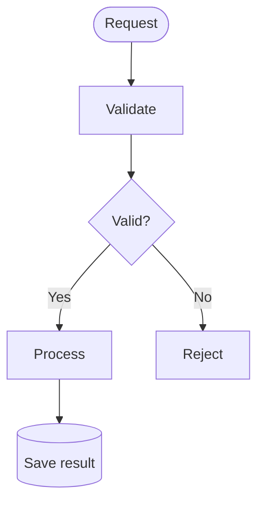
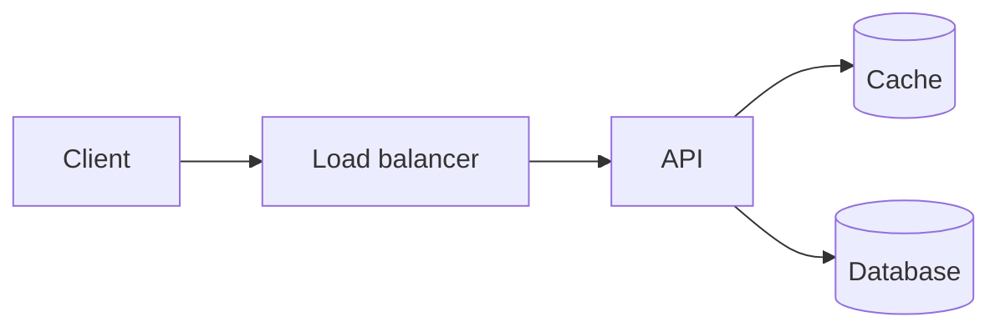
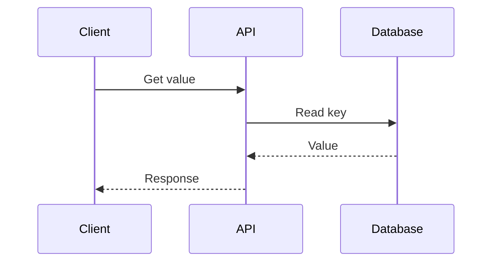

## Shared Styles

This draft is a local test page for the site's Mermaid theme. Change the shared theme in `src/plugins/mermaid-theme.mjs` to update all diagrams.

| Class | Meaning | Appearance |
| --- | --- | --- |
| `process` (also the default) | A service or processing step | Pale blue |
| `decision` | A branching condition | Pale amber |
| `storage` | A queue, cache, or persistent store | Pale teal |
| `terminal` | An entry point or stopped path | Slate with a dashed border |

Assign a class with `A[Process]:::process` or `class A,B process;`. The Markdown renderer inserts the shared `classDef` declarations into flowcharts automatically. Shapes and labels carry the meaning as well as color. Other diagram types use the shared base theme without flowchart classes.

## Workflow

Check that the main path reads top to bottom, decision edges have labels, and the rejected path stays short. “Validate” deliberately has no class to test the default style.

## Architecture

A left-to-right layout fits this request/data flow. Check that services, caches, and persistent storage remain distinct without decorative styling.

## Sequence

This checks that the shared theme also works for a different Mermaid syntax, without injecting flowchart-only `classDef` statements.

## Visual Checks

- Labels and arrowheads remain readable on desktop and narrow screens.
- Diagrams retain their light canvas when the site switches to dark mode.
- Small diagrams stay at their natural size instead of stretching to fill the page.
- All three diagrams render after navigating away and back.
- This draft is excluded from production routes and search results.
