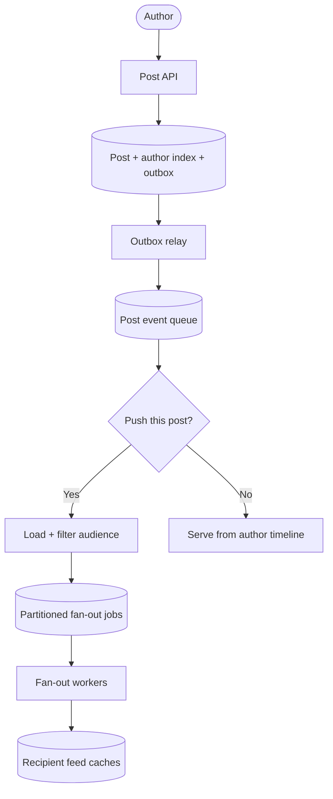
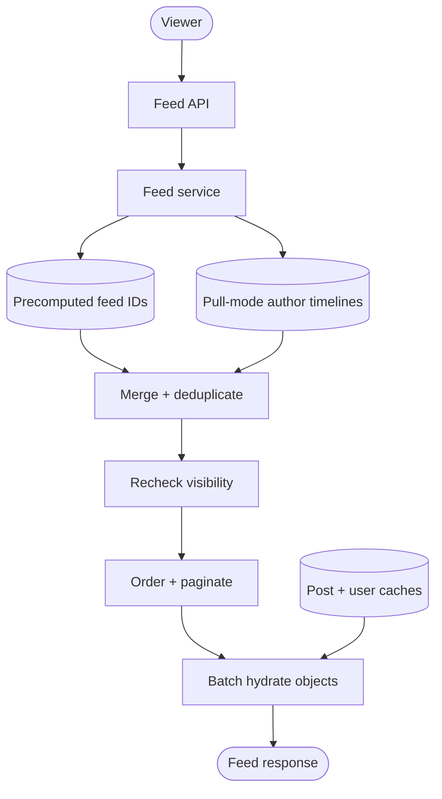

## Design at a Glance

**Scope:** users publish text and media posts and read posts from their friends. Following the chapter, assume 10 million daily active users, at most 5,000 friends per user, and a feed ordered in reverse chronological order. Media objects live in object storage and a CDN; the feed carries references and metadata rather than video or image bytes.

Start with this bounded friend graph. The hybrid design below also explores a one-way follower extension, where public accounts can have millions of followers; that audience is not subject to the 5,000-friend limit.

Clarify these decisions before drawing the high-level design:

| Question | Why it matters |
| --- | --- |
| Is the graph based on mutual friends or one-way followers? | It changes audience lookup, privacy rules, and the size of high-degree accounts. |
| Is the feed chronological or ranked? | Chronology can use creation time; ranking needs candidate generation, features, scoring, and experimentation. |
| How fresh must a new post be? | This sets the fan-out lag target and whether read-time merging is required. |
| What consistency is required for deletes, blocks, and privacy changes? | A stale derived feed must not continue exposing content that is no longer visible. |
| How deep can users paginate? | Keeping only recent IDs in memory is economical, but deep history needs a durable fallback. |

### What Is the Traffic Volume?

The chapter supplies 10 million DAU but not a complete request distribution. Add explicit assumptions during the interview:

```text
10 million DAU × 2 posts/day      = 20 million posts/day
                                      ≈ 231 writes/second average

10 million DAU × 10 feed reads/day = 100 million reads/day
                                      ≈ 1,157 reads/second average

231 posts/second × 200 recipients   ≈ 46,200 feed-entry writes/second
```

The 2 posts, 10 reads, and 200 eligible recipients are planning assumptions, not measured facts. A 5× peak would be about 1,155 post writes, 5,785 feed reads, and 231,000 feed-entry writes per second. The derived fan-out work can dominate the original post traffic.

If each active user keeps 500 entries containing an 8-byte post ID and an 8-byte ordering value, the raw feed index is about 80 GB:

```text
10 million × 500 × 16 bytes = 80 GB
```

Real memory use is higher because of data-structure overhead, metadata, replicas, and allocator fragmentation. Post bodies, user profiles, reactions, and media are separate.

## APIs and Data Model

A minimal external API is:

```text
POST /v1/posts
Idempotency-Key: <client-generated key>
{ text, media_ids, audience }

GET /v1/feed?limit=20&cursor=<opaque-cursor>
```

Authenticate with a header or session rather than placing a bearer token in the URL, where it may leak through logs and browser history. A successful post response means the post is durably stored; it need not wait for thousands of feed entries to be generated.

Keep authoritative and derived data separate:

| Data | Example fields | Role |
| --- | --- | --- |
| Post | `post_id`, `author_id`, body, media references, audience, `created_at`, status | Source of truth for published content. |
| Author timeline | `author_id`, `created_at`, `post_id` | Ordered access to each author's posts for pull queries and feed rebuilds. |
| Social graph | Source user, destination user, relationship, state | Determines who may be a candidate recipient. |
| Feed entry | `viewer_id`, `post_id`, ordering value, insertion metadata | Derived index that makes reads fast. |
| Interaction | Viewer, post, reaction type, time | Supports counters and future ranking features. |
| Fan-out event | Event ID, post ID, audience version, progress | Makes asynchronous distribution traceable and resumable. |

Use a globally unique post ID and a server-assigned creation time. Order by `(created_at, post_id)` for a deterministic tie-breaker. This defines timestamp order; clock skew means it is not necessarily the exact real-world order of concurrent posts across servers.

## Fan-Out on Write, Read, or Both

**Fan-out** is the process of distributing one post to many potential viewers.

| Strategy | How it works | Advantages | Costs |
| --- | --- | --- | --- |
| Fan-out on write (push) | Insert the new post ID into recipient feeds when it is published. | Very fast reads; new content is already materialized. | High write amplification; work is wasted for inactive viewers; high-degree authors create bursts. |
| Fan-out on read (pull) | At request time, fetch recent posts from followed authors and merge them. | No per-recipient write amplification; naturally reflects the current graph. | Read latency and query fan-out grow with the number of followed authors. |
| Hybrid | Push ordinary authors; pull high-degree authors and merge their timelines at read time. | Keeps common reads fast while bounding extreme write amplification. | More complex retrieval, deduplication, monitoring, and consistency behavior. |

For a bounded friend graph, start with push and measure its cost. With the follower extension, use hybrid delivery: push ordinary authors' posts into recipient caches and pull high-degree authors' posts at read time. Maintain author timelines for all authors so they also support cache rebuilds.

Choose the push/pull threshold using audience size, recipient activity, worker and storage capacity, and the freshness target. Rebuild recent feeds for returning users if fan-out skips inactive recipients. When an author's delivery mode changes, retain an overlap window or backfill recent entries so the transition creates no gaps; deduplicate overlapping candidates by post ID.

Consistent hashing can distribute viewer feeds and fan-out jobs across machines, but it does not remove the total work created by a high-degree author. Partitioning spreads write amplification; the hybrid policy reduces it.

Real systems choose differently according to their ranking and storage needs. LinkedIn's [FollowFeed design](https://www.linkedin.com/blog/engineering/feed/followfeed-linkedin-s-feed-made-faster-and-smarter) describes fan-out on read using per-entity timelines because it made relevance iteration and storage more suitable for that product. The correct answer is therefore a workload trade-off, not a universal preference for push.

## Publishing: Persist Once, Fan Out Selectively

The diagram shows the hybrid extension. In the push-only baseline, every post takes the Yes branch.



**Trace one post:** authenticate and rate-limit the author → validate content, media ownership, and audience → atomically commit the post and outbox event → return success → relay the event → apply the delivery policy. Push-mode jobs enumerate the social graph, filter eligibility, and insert IDs into recipient feeds; pull-mode posts skip those writes.

For this design, the author timeline is an index on the authoritative post store, maintained in the same transaction as the post. Every committed post is therefore queryable by author and time. A separate timeline service would require its own durable update stream and an explicit lag policy.

The outbox prevents a crash between database commit and publication from losing fan-out work. Relay publication can repeat, so workers enforce one `(viewer_id, post_id)` entry. Split audiences into bounded, checkpointed batches so failed partitions can resume independently.

## Retrieval: IDs First, Then Hydration



**Trace one read:** authenticate the viewer → load recent precomputed IDs → fetch recent posts from any pull-model authors → merge and deduplicate candidates → remove deleted or unauthorized posts → apply chronological ordering → select one page → batch-fetch post and author objects → return JSON with CDN media URLs.

Store only recent post IDs and ordering values in the feed cache, not full post and user objects. Copying entire objects into every recipient feed multiplies memory use and makes edits or profile changes expensive to propagate. **Hydration** batch-loads the shared post and author objects after the final IDs are selected. Avoid one lookup per item: issue multi-get or bounded parallel requests and watch tail latency.

Useful cache layers have different invalidation rules:

| Cache | Contents |
| --- | --- |
| Feed | Recent post IDs per viewer. |
| Content | Post metadata and bodies; keep hot posts longer. |
| Social graph | Friends, followers, blocks, and mutes. |
| Actions | Whether a viewer liked, saved, or replied. |
| Counters | Like, reply, repost, follower, and following counts. |

The feed cache is a bounded materialized view. On a miss, query eligible authors' timelines and rebuild the recent window; coalesce concurrent rebuilds for one viewer and limit fallback work to protect storage. Older pages use the durable timelines rather than assuming the cache contains all history.

## Chronology, Pagination, and Ranking

Queue processing order is not creation order. Two fan-out events can arrive late or be retried, so insert by the post's ordering tuple rather than blindly appending by worker arrival time.

Prefer cursor pagination over numeric offsets:

```text
First page:  newest items, limit 20
Next cursor: (created_at, post_id) of the last returned item
Next page:   items strictly older than that tuple
```

An opaque, signed cursor can encode this boundary. Offset pagination can duplicate or skip items when newer posts arrive between page requests. The deterministic post ID tie-breaker also prevents ambiguity when several posts share one timestamp.

A cursor does not provide snapshot completeness. If page one ends at 10:00 and delayed fan-out later inserts a 10:01 post, subsequent pages requesting items older than 10:00 will miss it. This design accepts that the post appears on refresh. A complete, stable traversal would require a versioned candidate snapshot and a defined ingestion watermark or completeness boundary.

If the product changes from chronology to personalization, preserve the same broad serving pipeline but separate **candidate generation** from **ranking**. Candidate sources maximize coverage; a later stage filters and scores a manageable set. Modern feed systems often use this funnel: LinkedIn describes a first pass that gathers candidates and a second pass that ranks them in its [feed-ranking architecture](https://www.linkedin.com/blog/engineering/feed/leveraging-dwell-time-to-improve-member-experiences-on-the-linkedin-feed). Do not silently call a relevance-ranked feed “chronological.”

## Visibility Changes, Deletes, and Consistency

Fan-out creates derived copies, so graph and content changes need explicit policies:

| Change | Required behavior |
| --- | --- |
| Delete a post | Mark the authoritative post unavailable immediately, reject it during read-time validation, and remove cached entries asynchronously. |
| Block or unfriend | Enforce the current relationship on reads, then scrub affected feed entries in the background. |
| Change a post's audience | Treat reduced visibility as a security-sensitive invalidation; stale feed IDs must not grant access. |
| Edit content | Update the one post object; ID-only feed entries need no rewrite. Invalidate the content cache. |
| Create a post | Provide read-your-writes by synchronously adding it to the author's own timeline or merging the author's posts during reads. |

The general feed can be eventually consistent—a friend's new post may take a few seconds to appear—but authorization must be checked against authoritative or safely invalidated state before returning content. A stale candidate ID is acceptable; leaking a now-private post is not.

## Reliability and Operations

- **Growing backlog:** if queue age rises while downstream storage is healthy, increase consumer capacity within storage limits. Slowing consumption solely because the queue is old makes the backlog worse.
- **Downstream overload:** reduce worker concurrency when storage is saturated, and propagate backpressure toward producers through admission limits, deferred bulk work, or reduced optional fan-out. Continued publishing is safe only within explicit backlog and freshness budgets.
- **Hot keys:** shard large recipient sets and cache popular post objects, but avoid letting one author monopolize workers. Use per-author or per-tenant limits and fair scheduling.
- **Degraded reads:** if one candidate source times out, return a smaller feed when product requirements permit rather than failing the entire request. Record that it was partial.
- **Recovery:** periodically test feed reconstruction from durable author timelines.
- **Multi-region:** keep post and graph ownership clear, replicate source events, and serve viewer feeds near their read region. Define how cross-region lag affects freshness and deletes.

Monitor p50, p95, and p99 feed latency; post-to-feed lag; queue age; fan-out entries per post; feed-cache and object-cache hit rates; hydration batch latency; partial-response rate; duplicate entries; and delete/privacy propagation time. Averages alone conceal celebrity bursts and slow partitions.

## Quick Revision Questions

1. Why can 231 post writes per second create tens of thousands of feed-cache writes per second?
2. When is fan-out on read preferable to fan-out on write?
3. Why does consistent hashing not solve celebrity write amplification by itself?
4. What does hydration add after the service retrieves feed IDs?
5. How does a transactional outbox prevent a stored post from being lost before fan-out?
6. Why use a `(created_at, post_id)` cursor, and what happens to late-arriving posts above its boundary?
7. How can the service prevent a deleted or newly private post from leaking through stale feed entries?

## Vocabulary and Interview Phrases

| Word or phrase | Plain meaning | Example in context |
| --- | --- | --- |
| chronological | Ordered by time | “The simplified feed is reverse chronological, with newest posts first.” |
| What is the traffic volume? | A clarification about requests, users, data, and peak load | “What is the traffic volume for publishing and feed retrieval?” |
| high-level design | The main components and data flow before implementation detail | “Confirm the high-level design before deep-diving into fan-out.” |
| fan-out | Expand one event into work for many recipients or partitions | “The service fans out a post to eligible friends.” |
| hydration | Replace lightweight IDs with the complete objects needed by the response | “Hydration loads post text, author names, and media references.” |
| materialized view | A stored result derived from authoritative data to make reads faster | “A recipient's feed cache is a materialized view.” |
| write amplification | One logical write causing many physical writes | “Fan-out on write introduces write amplification.” |
| hot key | A key or owner receiving disproportionately high traffic | “A high-degree author can create a hot-key workload.” |
| candidate generation | Collect a broad set of items that may be shown | “Candidate generation happens before personalized ranking.” |
| cursor pagination | Continue from a stable item boundary rather than a numeric offset | “Cursor pagination handles new posts arriving between requests.” |
| read-your-writes | A user can immediately read their own successful update | “The author expects read-your-writes after publishing.” |
| eventual consistency | Replicas or derived views converge after a delay | “Friend feeds may be eventually consistent with the post store.” |

*Primary reference: Alex Xu, System Design Interview – An Insider’s Guide, Volume 1, Chapter 11, [Design a News Feed System](https://bytebytego.com/courses/system-design-interview/design-a-news-feed-system). The linked LinkedIn engineering articles provide real-world context for fan-out-on-read and multi-stage ranking.*

*Authorship note: This revision guide was written and refined with AI assistance for personal study and interview review.*
