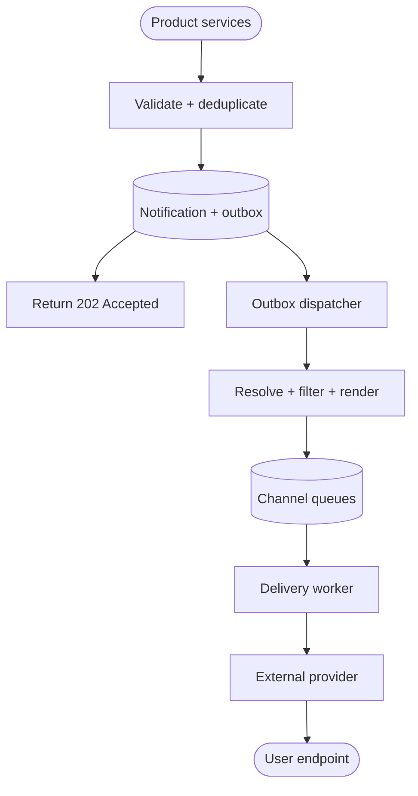
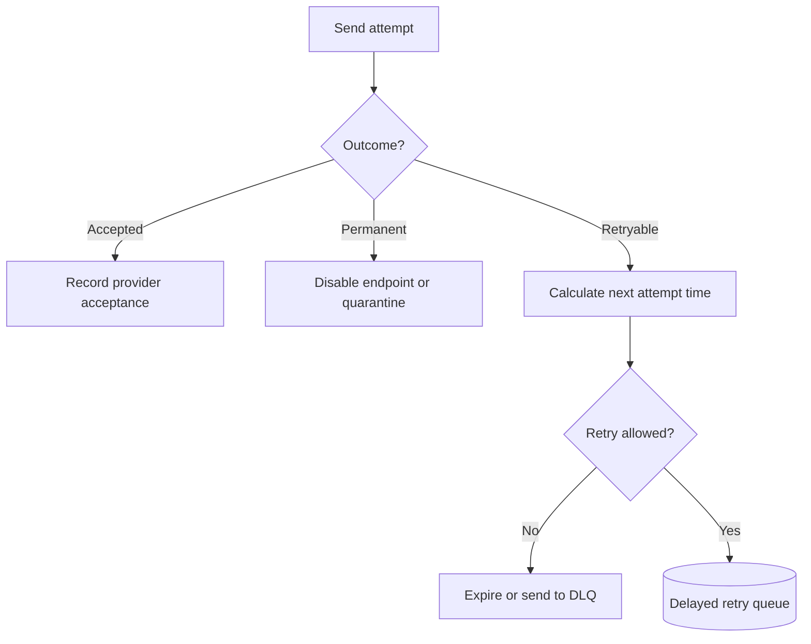

## Design at a Glance

**Scope:** send transactional and product notifications through mobile push, SMS, and email. The system accepts requests from trusted product services, applies user preferences and rate limits, renders channel-specific content, and hands messages to external providers. It should scale horizontally, tolerate provider failures, and avoid unnecessary duplicate notifications.

Clarify the product contract before choosing components:

| Question | Why it changes the design |
| --- | --- |
| Which channels and notification types are required? | Push, SMS, and email have different identifiers, payloads, costs, provider limits, and delivery feedback. |
| Is delivery immediate, scheduled, or both? | Scheduled messages need durable timing state; a normal queue alone is not a long-term scheduler. |
| How reliable must each type be? | A password-reset alert and a promotional campaign should not share the same expiry, priority, or retry policy. |
| May messages arrive twice or out of order? | At-least-once queues and ambiguous provider timeouts require idempotency and product-specific ordering rules. |
| What may users control? | Per-channel, per-topic, quiet-hour, and frequency preferences affect eligibility before delivery. |

Assume the chapter's illustrative daily volumes:

```text
10 million push notifications/day ≈ 116/second average
 1 million SMS messages/day        ≈  12/second average
 5 million emails/day              ≈  58/second average
Total                              ≈ 185/second average
```

Average traffic is not enough for capacity planning. A product launch or breaking event can create a much larger burst; a 10× planning assumption would be about 1,850 notifications/second before retries. If each retained notification record averages 1 KB, 16 million records add about 16 GB/day or 5.8 TB/year before indexes and replicas. State the assumptions rather than presenting them as measured facts.

## Channels and Endpoints

| Channel | Destination and delivery concerns |
| --- | --- |
| Mobile push | An app registration addressed through APNs or FCM. Keep payloads small, avoid sensitive lock-screen content, and set priority and expiry deliberately. |
| SMS | A normalized phone number. Account for provider/sender limits, cost, delivery status, and opt-out signals. |
| Email | An email address. Render subject, HTML, and plain text; process bounces and complaints; consider separating transactional and bulk traffic for reputation isolation. |

Registrations can change, and one user may have several devices. Obtain current APNs tokens from the app and associate them with the correct account; see [Apple's registration guidance](https://developer.apple.com/documentation/usernotifications/registering-your-app-with-apns). Maintain registration timestamps and remove stale or invalid endpoints as described in [FCM's registration guidance](https://firebase.google.com/docs/cloud-messaging/manage-tokens).

## High-Level Design

The API validates the request and commits the logical notification and an outbox row in one transaction. Only then does it return `202 Accepted` with a notification ID. Eligibility checks and delivery continue asynchronously; acceptance does not promise that every requested channel will be used.



Supporting stores are deliberately kept out of the main path in the diagram:

| Store | Typical contents | Important invariant |
| --- | --- | --- |
| User endpoints | APNs/FCM registrations, phone numbers, email addresses, status, last update | One user may have several devices and endpoints change over time. |
| Preferences | Notification type, channel, enabled state, quiet hours, locale | The policy used for a send should be identifiable later. |
| Templates | Versioned subject, body, variables, locale, channel | Render only approved variables and retain the template version. |
| Notification records | Notification ID, source event, recipient, channel, status, expiry | A durable record exists before asynchronous delivery begins. |
| Delivery attempts | Provider request ID, attempt number, timestamps, response category | Every retry remains traceable to the same logical notification. |

Cache frequently read endpoints, preferences, and templates, but keep their databases authoritative. Invalidation matters: a user who disables marketing notifications should not continue receiving them because a stale cache entry lives indefinitely.

### Trace One Request

1. A product service supplies an idempotency key, notification type, recipient, template data, channels, priority, and optional schedule or expiry.
2. The API authenticates and authorizes the caller, validates the request, applies source limits, and commits the notification and outbox row before returning acceptance.
3. The dispatcher triggers a resumable planner. It resolves current endpoints and preferences, then persists one rendered job per eligible channel and destination, with an outbox entry for publication. If none are eligible, it records suppression.
4. The job dispatcher publishes to separate push, SMS, and email queues. Repeated planning or publication reuses stable job IDs so it does not create extra logical deliveries.
5. A worker claims a job, performs the final expiry and suppression checks, calls the provider, records the attempt, and either completes, retries, or quarantines the job.
6. Provider callbacks update delivery, bounce, complaint, or invalid-endpoint state where the channel supplies that feedback.

For scheduled notifications, persist the due time and release the request to planning when it becomes due. Resolve current preferences and endpoints then, rather than freezing them months in advance.

The **transactional outbox** closes the database–broker dual-write gap: a crash after commit leaves durable work for the dispatcher to resume. Mark an outbox entry published only after broker acknowledgment. A crash between publication and that update can cause redelivery, so consumers still need idempotency.

## Queues Decouple Work; They Do Not Guarantee Delivery

Adopt a message queue between intake and provider calls for three reasons:

- **Isolation:** an email-provider outage does not stop push delivery or block product APIs.
- **Burst absorption:** producers can enqueue faster than providers can temporarily accept, within a bounded backlog.
- **Horizontal scaling:** add workers for the channel whose queue age is growing.

Use a separate queue per channel and, where justified, per priority class. A critical security alert should not wait behind a large marketing campaign. Preserve fairness so a constant high-priority stream cannot starve ordinary transactional work.

A queue is not infinite capacity. When arrival rate remains above delivery capacity, queue age grows until notifications become useless or retention expires. Apply admission control, campaign pacing, provider quotas, and backpressure. Scale on **oldest-message age and send latency**, not queue depth alone: 100,000 emails may be healthy at high throughput, while 500 password-reset messages waiting ten minutes are not.

Many high-throughput queues use at-least-once delivery. For example, [Amazon SQS standard queues](https://docs.aws.amazon.com/AWSSimpleQueueService/latest/SQSDeveloperGuide/standard-queues.html) may deliver a message more than once and occasionally out of order. Workers must therefore tolerate redelivery.

## At-Least-Once Processing and Duplicate Control

There are two different duplicate risks:

| Duplicate source | Example | Deduplication mechanism |
| --- | --- | --- |
| Repeated API submission | The caller times out and resends the same event. | Require an idempotency key or stable source-event ID and enforce a uniqueness constraint. |
| Repeated worker delivery | A worker sends successfully, crashes before acknowledging the queue, and receives the job again. | Record attempts by logical notification and make local side effects idempotent. |

Use `(source, event_id, recipient, notification_type)` to identify the logical request, and a separate stable job ID for each channel and destination. This prevents a successful email from suppressing a requested push. Retries reuse those IDs; retain deduplication records for the supported retry and replay window.

Exactly-once end-user delivery is generally not achievable across an external provider boundary. Consider this sequence:

```text
worker sends → provider accepts → response is lost → worker times out → worker retries
```

The worker cannot tell whether the first attempt failed before acceptance or succeeded and merely lost its response. A provider-supported idempotency key can narrow this gap, but not every channel offers one and a device may still display a notification more than once. Design for **at-least-once attempts with best-effort duplicate suppression**, and make sensitive actions themselves safe: tapping the same payment or password-reset notification twice must not repeat the business operation.

Provider failover has the same ambiguity. Switching to a secondary provider after a definite rejection is safer than switching after a timeout: the original provider may already have accepted the message, so failover can create a cross-provider duplicate. Decide whether the availability benefit is worth that risk for each notification type.

Ordering has similar limits. Separate queues, parallel workers, retries, and provider behavior can reorder messages. If order matters for one conversation or entity, include a sequence/version and let stale notifications expire or collapse; avoid imposing a global order that the product does not require.

## Retry Only Failures That May Recover

Classify provider outcomes instead of retrying every failure:

| Outcome | Examples | Response |
| --- | --- | --- |
| Accepted | Provider returns success or a message ID | Record provider acceptance; do not call this device delivery. |
| Transient | Timeout, connection failure, provider `429`, provider `5xx` | Respect provider retry delays; use backoff, jitter, expiry, and an attempt limit. |
| Permanent request failure | Invalid payload, unsupported sender, authentication/configuration error | Stop automatic retries, alert when appropriate, and send to a dead-letter queue for diagnosis. |
| Invalid endpoint | Unregistered device token, hard email bounce, invalid phone number | Disable or remove that endpoint and stop sending to it. |
| Expired | An event reminder arrives after the event or exceeds its TTL | Discard it rather than deliver stale information. |



Calculate the next attempt using exponential backoff with jitter, but never earlier than the provider permits. [FCM's error guidance](https://firebase.google.com/docs/cloud-messaging/error-codes) requires honoring `Retry-After` for unavailable responses and a minimum one-minute initial delay for overall-message-rate or topic-rate quota failures. An urgent one-time password does not override these constraints: if the next permitted attempt is at or beyond expiry, discard the job.

The delayed queue releases eligible jobs back to the send worker. Check expiry again before sending. Exhausted attempts go to a monitored dead-letter queue (DLQ); expired jobs receive a terminal expired status. A DLQ supports diagnosis and controlled replay, as described in [AWS's guidance](https://docs.aws.amazon.com/AWSSimpleQueueService/latest/SQSDeveloperGuide/sqs-dead-letter-queues.html). Acknowledge the current queue message only after its outcome or retry handoff is durable.

## Provider Acceptance Is Not User Delivery

Use a precise state model:

```text
requested → queued → provider accepted → delivered, if confirmed → opened, if observed
                         └──────────────→ failed or expired
```

Not every channel exposes every transition. An API success often means only that the provider accepted responsibility for an attempt. [FCM explicitly distinguishes acceptance from device delivery](https://firebase.google.com/docs/cloud-messaging/customize-messages/setting-message-lifespan), and a message can later expire or be discarded. Likewise, [APNs is a best-effort service](https://developer.apple.com/documentation/usernotifications/sending-notification-requests-to-apns) and may store, coalesce, or reorder pending notifications.

Keep product metrics separate:

- **API acceptance rate:** did the notification system durably accept requests?
- **Queue delay:** how long did work wait before its first attempt?
- **Provider acceptance rate and latency:** did the downstream provider accept the request?
- **Confirmed delivery, bounce, and invalid-endpoint rate:** what outcome feedback did the channel return?
- **Open or click rate:** did the user engage, where tracking and consent allow it?

An end-to-end notification ID should appear in records, queue jobs, structured logs, and provider metadata or callbacks. Do not put message bodies, tokens, phone numbers, or email addresses into unrestricted logs.

## Preferences and Notification Fatigue

Model preferences at the granularity the product promises:

```text
user × notification type × channel × enabled
                         + quiet hours and timezone
                         + frequency cap
                         + locale
```

Check preferences before enqueueing to save work, then consider a final suppression check before sending so a recent opt-out takes effect. Define which indispensable account or security messages are allowed independently of marketing preferences, and keep that policy narrow and auditable. Rate limits should exist at several scopes: per producer to contain bugs, per provider to respect quotas, and per recipient/type to prevent notification fatigue.

For fan-out campaigns, do not expand millions of recipients inside one API request or place the entire audience in one queue message. Persist a campaign, have partitioned fan-out workers enumerate recipients in bounded batches, apply preferences to each recipient, and pace delivery. This makes progress resumable and avoids one oversized job becoming a failure hotspot.

## Provider Integration and Security

Provider adapters translate internal jobs into vendor requests and map responses into the outcome categories above. Keep channel-specific behavior, such as retry delays and endpoint invalidation, explicit in each adapter.

Treat recipient endpoints and provider credentials as sensitive data. Encrypt data in transit and at rest, restrict service access, keep provider credentials in managed secret storage, and rotate them. Escape untrusted template variables for their output context, and authenticate provider callbacks before applying status or endpoint changes; callback handling should itself be idempotent.

## Quick Revision Questions

1. Why does adopting a message queue not give exactly-once notification delivery?
2. What should happen when a worker times out after the provider may have accepted the request?
3. Why should push, SMS, and email have separate queues and worker pools?
4. Which metric reveals an old backlog more clearly than queue depth?
5. When should a failed message be retried, discarded, or sent to a dead-letter queue?
6. Why must notification preferences sometimes be checked both before enqueueing and before sending?
7. How would you fan out a campaign to ten million recipients without one enormous job?

## Vocabulary and Interview Phrases

| Word or phrase | Plain meaning | Example in context |
| --- | --- | --- |
| indispensable | Absolutely necessary | “Security alerts may be treated as indispensable account messages, subject to a narrow policy.” |
| discard | Throw away because an item is invalid or no longer useful | “Discard an expired event reminder instead of sending stale information.” |
| deduplication mechanism | A method for detecting and suppressing repeated work | “An idempotency key is the API's deduplication mechanism.” |
| fine-grained | Detailed and specific | “Users can set fine-grained preferences by topic and channel.” |
| adopt a message queue | Introduce a queue into the architecture | “Adopt a message queue to isolate producers from slow delivery providers.” |
| fan-out | Expand one event into work for many recipients or channels | “Campaign workers fan out one announcement in bounded batches.” |
| backpressure | A way for overloaded consumers to slow or limit producers | “Backpressure prevents an unbounded delivery backlog.” |
| idempotent | Safe to perform repeatedly without changing the final effect after the first success | “Make local attempt recording idempotent under queue redelivery.” |
| exponential backoff | Increase the wait after each successive failure | “Use exponential backoff for temporary provider errors.” |
| jitter | Random variation added to a retry delay | “Jitter prevents all workers from retrying at the same instant.” |
| dead-letter queue | A holding queue for work that repeatedly cannot be processed | “Alert when a message enters the dead-letter queue.” |
| delivery receipt | Provider feedback about a later delivery outcome | “An SMS delivery receipt updates the attempt status.” |

*Primary reference: Alex Xu, System Design Interview – An Insider’s Guide, Volume 1, Chapter 10, [Design a Notification System](https://bytebytego.com/courses/system-design-interview/design-a-notification-system). The linked Apple, Firebase, and AWS documentation supports the provider, token, queue, and retry clarifications.*

*Authorship note: This revision guide was written and refined with AI assistance for personal study and interview review.*
