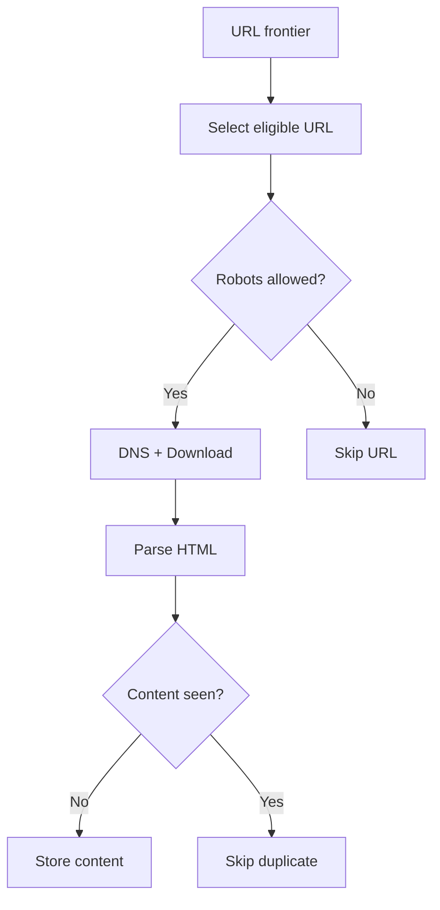
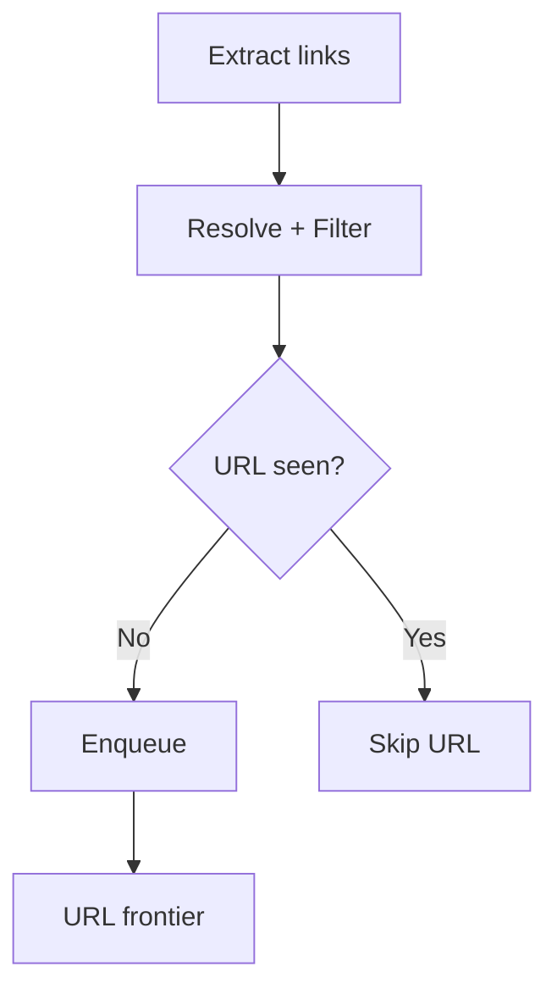

## Design at a Glance

**Scope:** discover and download HTML for search indexing, revisit changed pages, and retain content. Clarify coverage, freshness, retention, and supported content types before sizing the system.

Using the chapter’s assumptions:

```text
1 billion pages/month ÷ 30 days ≈ 386 pages/second
Rounded planning rate          ≈ 400 average / 800 peak
1 billion × 500 KB              ≈ 500 TB/month
Five years of retained content ≈ 30 PB
```

The peak multiplier is an assumption. Storage is raw, before compression, deduplication, indexes, and replication.

## The Crawl Loop

**Fetch and store:** seed URLs initialize the frontier. Select an eligible URL, check robots rules, then download and validate its HTML before checking for duplicate content.



**Discover URLs:** extract links from the newly stored content and enqueue unseen URLs. The frontier below is the same queue used above; this completes the crawl loop.



Repeated URLs are skipped during discovery; scheduled recrawls are handled separately. Download failures enter a retry policy, not the successful parsing path. Keep downloader, parser, and storage responsibilities separate so new content handlers can be added independently.

## URL Frontier: Priority, Politeness, and Freshness

The frontier stores pending URLs and decides **what to fetch next and when a host can be contacted**. A plain BFS queue can produce bursts against one host; DFS can spend too long down a deep chain.

| Part | Responsibility |
| --- | --- |
| Front queues | Prioritize useful pages using importance and change history. |
| Host router and back queues | Group URLs by host so its request rate can be controlled. |
| Eligible-host selector | Choose a host whose next allowed fetch time has arrived. |
| Recrawl scheduler | Revisit important or frequently changing pages sooner. |

For example, if `a.example` must wait until 10:00:02, workers can fetch from an eligible `b.example` meanwhile. Increasing worker count must not multiply a host’s request rate: coordinate host ownership or limits across workers.

Keep the large backlog on disk with memory buffers for active work. Priority determines preference; politeness determines eligibility. See the [URL frontier discussion in Introduction to Information Retrieval](https://nlp.stanford.edu/IR-book/html/htmledition/the-url-frontier-1.html).

## Two Different Duplicate Checks

| Check | Question | Why it matters |
| --- | --- | --- |
| URL seen? | Is this normalized address already queued or fetched? | Avoid repeated downloads and link cycles. |
| Content seen? | Has this document already been stored under another address? | Avoid storing and processing identical pages repeatedly. |

Content fingerprints identify candidate exact duplicates; near-duplicates need similarity techniques such as shingling. See [duplicate detection](https://nlp.stanford.edu/IR-book/html/htmledition/near-duplicates-and-shingling-1.html).

**Implementation caveats:** resolve relative links against the page’s base URL. Do not blindly remove query parameters, since they may select different content. A Bloom filter used alone for “URL seen?” can skip unseen pages through false positives; use an exact check when coverage matters. A “seen” record should distinguish queued, in-progress, and completed work so a worker crash does not permanently lose a URL.

## Politeness and Failure Handling

- **Robots rules:** fetch and cache `robots.txt`, apply the matching user-agent rules, and refresh the cache. `Crawl-delay` is not defined by RFC 9309; per-host pacing remains a separate policy. Robots rules are not access authorization. See the [Robots Exclusion Protocol](https://www.rfc-editor.org/rfc/rfc9309.html).
- **Slow or failing hosts:** use timeouts, bounded retries, and backoff; respect `Retry-After` when supplied. Cache DNS results within their lifetime.
- **Crawler crashes:** persist scheduling state, reclaim unfinished work, and make repeated processing safe. An in-memory queue alone cannot provide recovery.
- **Spider traps and malformed input:** bound redirects, response size, and crawl budgets; detect endlessly generated URL patterns. URL deduplication alone cannot stop a trap that creates a fresh URL each time.

## Quick Revision Questions

1. Why does a single FIFO queue fail to ensure politeness?
2. What do front queues and back queues each control?
3. Why are both URL and content deduplication needed?
4. How does an already-seen URL become eligible for recrawling?
5. What happens if a worker crashes after taking a URL from the frontier?

## Vocabulary and Interview Phrases

| Word or phrase | Plain meaning | Example in context |
| --- | --- | --- |
| trademark infringements | Unauthorized uses that violate trademark rights; 商标侵权 | “A monitoring crawler can flag suspected trademark infringements.” |
| pirated works | Unauthorized copies of protected works; 盗版作品 | “The crawler looks for suspected pirated works.” |
| gigantic | Extremely large | “A web-scale crawl produces a gigantic dataset.” |
| dedicated | Assigned to a particular purpose | “A dedicated team maintains the crawler.” |
| vastly | To a much greater extent | “The full web is vastly larger than one website.” |
| parallelization | Doing multiple tasks at the same time | “Parallelization improves throughput across different hosts.” |
| scalability | Ability to handle growth | “Partitioning work improves scalability.” |
| extensibility | Ease of adding new capabilities | “Separate parsers improve extensibility.” |
| propose a high-level design and get buy-in | Present the main approach and obtain agreement | “Confirm the crawl pipeline before discussing each component.” |
| open-ended question | A question with several reasonable answers | “Choosing seed URLs is an open-ended question.” |
| think out loud | Explain reasoning as it develops | “Think out loud while comparing scheduling policies.” |
| provoke problems | Cause problems; “cause problems” is more natural here | “Malformed HTML can cause problems for a parser.” |
| eliminate data redundancy | Remove unnecessary duplicate data | “Content deduplication helps eliminate data redundancy.” |
| too big to fit in memory | Larger than available RAM | “The frontier is too big to fit in memory.” |
| malformed | Incorrectly structured or formatted | “The parser must handle malformed HTML.” |

*Primary reference: Alex Xu, System Design Interview – An Insider’s Guide, Volume 1, Chapter 9, [Design a Web Crawler](https://bytebytego.com/courses/system-design-interview/design-a-web-crawler). The linked textbook and protocol references support the additional implementation notes.*

*Authorship note: This revision guide was refined with AI assistance.*
